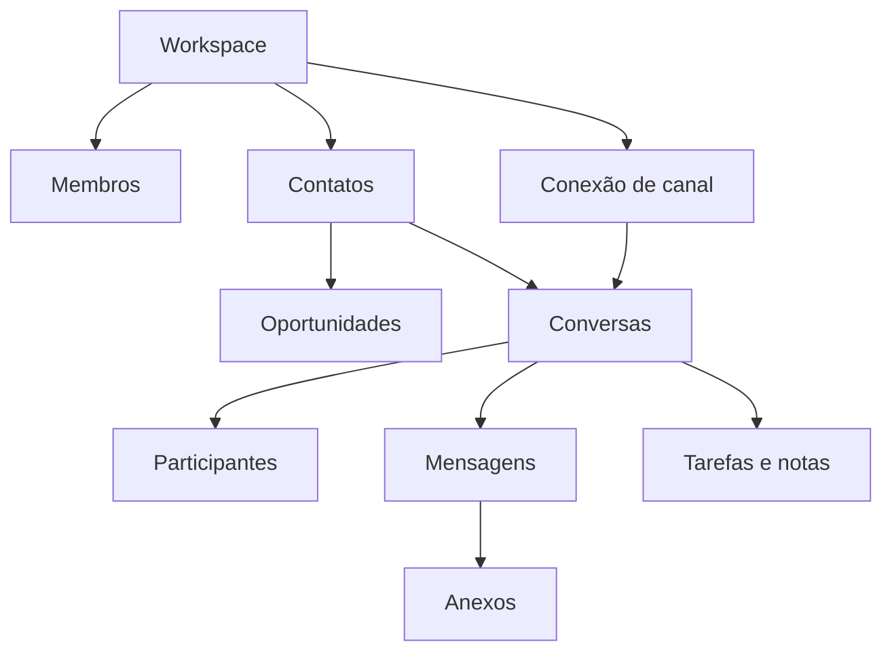
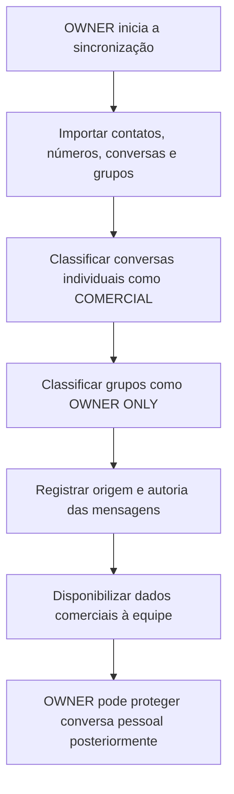
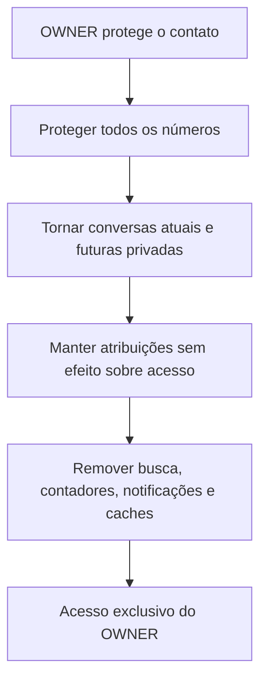
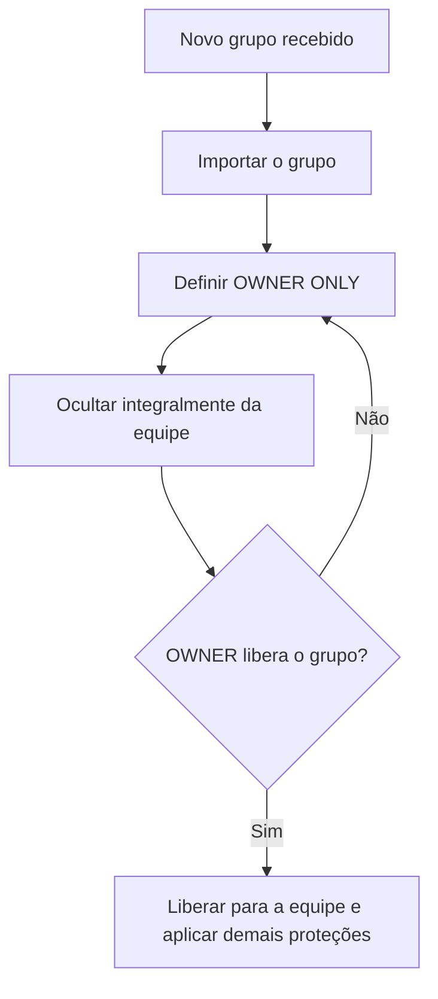
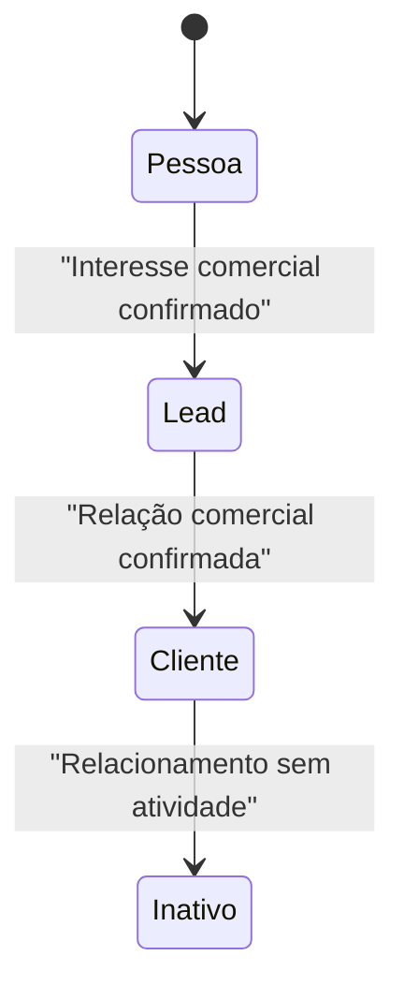
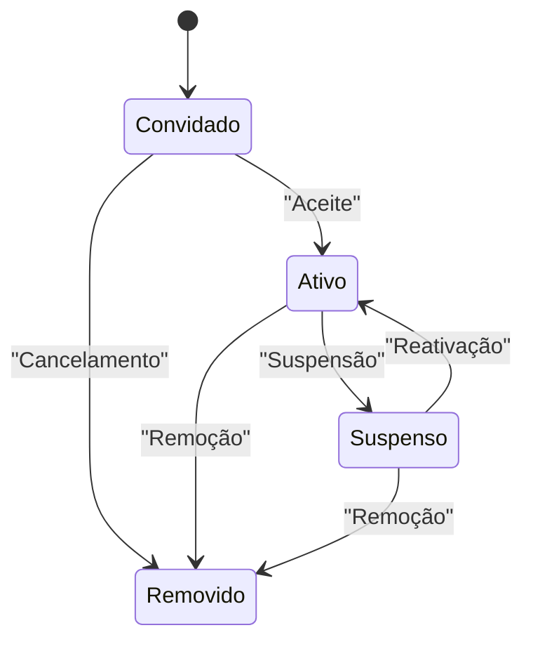

# Fluxos conceituais de negócio do ImobFlux

Status: consolidação final da Sprint 8.

Os fluxos descrevem comportamento do produto, sem definir telas, banco de
dados, APIs, autenticação ou integração técnica.

## Visão geral

Regras transversais:

- todo registro pertence a um workspace;
- todos os membros ativos podem visualizar e editar informações comerciais;
- atribuições indicam responsabilidade operacional e não restringem o acesso
  comercial;
- toda conversa individual nova ou importada nasce `COMERCIAL`, sem estado
  intermediário, pendente ou desconhecido;
- contato protegido prevalece sobre atribuições;
- conversa privada é totalmente invisível para ATTENDANT;
- somente o OWNER pode proteger ou liberar individualmente uma conversa;
- liberar uma conversa não libera outras, não remove proteção do contato e não
  altera o histórico privado;
- grupo é `OWNER ONLY` até liberação individual;
- cada mudança relevante produz auditoria sem copiar conteúdo privado;
- simples visualizações não produzem auditoria no MVP;
- registros são arquivados ou inativados, sem exclusão física no uso normal;
- a auditoria é permanente, não pode ser apagada e somente o OWNER pode
  consultá-la integralmente;
- somente o OWNER pode exportar dados do sistema;
- o MVP permite uma conexão de WhatsApp ativa por workspace, mantendo o modelo
  preparado para múltiplas conexões futuras.

## 1. Criação do Workspace

- **Ator:** pessoa que inicia o negócio no ImobFlux.
- **Pré-condição:** não existe workspace correspondente em processo de criação.
- **Comportamento:**
  1. o sistema cria o workspace com situação ativa;
  2. estabelece fuso horário e configurações administrativas mínimas;
  3. cria o vínculo do primeiro OWNER no mesmo processo;
  4. prepara os cadastros conceituais básicos do workspace;
  5. registra a criação na auditoria.
- **Resultado:** existe um workspace isolado, com exatamente um OWNER ativo e
  sem dados compartilhados com outros workspaces.
- **Não ocorre:** criação de atendentes, sincronização de canal ou liberação de
  dados comerciais.

## 2. Primeiro OWNER

- **Ator:** sistema, como parte da criação do workspace.
- **Pré-condição:** o workspace acabou de ser criado.
- **Comportamento:**
  1. a identidade da pessoa é associada ao workspace;
  2. o vínculo recebe papel OWNER e situação ativa;
  3. o OWNER recebe a responsabilidade administrativa e de privacidade;
  4. a autoria inicial é registrada.
- **Resultado:** o workspace nunca fica sem proprietário ativo.
- **Regra:** a futura transferência de propriedade exige fluxo próprio,
  confirmação forte e auditoria; ainda não está definida.

## 3. Primeira sincronização

- **Ator:** OWNER inicia; sistema executa.
- **Pré-condições:** workspace ativo, OWNER ativo e uma conexão de WhatsApp apta
  para sincronização.
- **Comportamento oficial:**
  1. importa todos os contatos e números disponíveis;
  2. importa conversas individuais diretamente como `COMERCIAL`;
  3. importa grupos diretamente como `OWNER ONLY`;
  4. associa números e participantes quando houver correspondência confiável;
  5. registra cada mensagem com origem CRM ou WhatsApp;
  6. não presume autoria interna para mensagens originadas fora do CRM;
  7. aplica imediatamente proteções já existentes;
  8. disponibiliza as conversas comerciais a todos os membros ativos;
  9. permite ao OWNER proteger posteriormente conversas pessoais.
- **Resultado:** os dados são importados sem estado intermediário; conversas
  individuais ficam comerciais e grupos continuam privados.
- **Auditoria:** início, término, falhas e alterações de privacidade são
  registrados sem conteúdo de mensagens. A leitura do conteúdo importado não
  produz evento de visualização.

## 4. Classificação direta das conversas

- **Ator:** sistema classifica; OWNER administra privacidade posteriormente.
- **Pré-condição:** conversa recebida, criada ou importada no workspace.
- **Comportamento:**
  1. conversa individual nasce `COMERCIAL`;
  2. não utiliza estado pendente, desconhecido, quarentena ou revisão;
  3. se o contato ou ponto de contato já estiver protegido, a conversa herda a
     privacidade;
  4. grupo nasce `OWNER ONLY`;
  5. OWNER pode proteger depois uma conversa individual pessoal;
  6. marcar uma única conversa como privada não protege automaticamente as
     outras conversas do contato.
- **Resultado:** cada conversa possui classificação definitiva desde sua
  criação, sem etapa temporária.

## 5. Proteção de contato

- **Ator:** exclusivamente OWNER.
- **Pré-condição:** contato pertence ao workspace.
- **Comportamento:**
  1. contato recebe política de proteção;
  2. todos os números associados herdam a proteção;
  3. todas as conversas atuais tornam-se privadas;
  4. futuras conversas iniciam como `OWNER ONLY`;
  5. atribuições permanecem apenas como indicação de responsabilidade e não
     alteram a proteção;
  6. resultados de busca, contadores e notificações são revogados;
  7. prévias, nomes, imagens, anexos, caches e dados derivados são removidos do
     alcance de atendentes;
  8. eventos de revogação e proteção são auditados.
- **Resultado:** somente OWNER acessa o contato e seus contextos protegidos.
- **Regra:** a proteção do contato sempre vence uma atribuição ou liberação
  anterior.

### 5.1 Contato protegido que passa a ser comercial

- **Ator:** exclusivamente OWNER.
- **Pré-condição:** contato protegido passa a integrar o contexto comercial.
- **Comportamento:**
  1. OWNER remove a proteção para as interações futuras;
  2. todas as conversas, mensagens, anexos e dados derivados anteriores
     permanecem `OWNER ONLY`;
  3. nenhuma atribuição ou classificação libera o histórico anterior;
  4. somente as novas conversas podem receber visibilidade da equipe;
  5. a mudança e seu marco temporal são registrados na auditoria.
- **Resultado:** a equipe colabora nas conversas futuras sem receber acesso
  retroativo ao histórico privado.

## 6. Proteção de conversa

- **Ator:** exclusivamente OWNER.
- **Pré-condição:** conversa pertence ao workspace.
- **Comportamento:**
  1. a conversa escolhida recebe visibilidade privada;
  2. mensagens, anexos, participantes, prévias e metadados herdam a restrição;
  3. atribuições permanecem sem efeito sobre a autorização;
  4. dados derivados são revogados;
  5. a mudança é auditada.
- **Resultado:** somente a conversa escolhida fica privada.
- **Não ocorre:** o contato não é protegido e suas outras conversas não mudam.

### 6.1 Liberação individual de conversa

- **Ator:** exclusivamente OWNER.
- **Pré-condição:** conversa privada pertencente ao workspace.
- **Comportamento:**
  1. registra o momento da liberação;
  2. preserva como privados todas as mensagens, anexos e dados derivados
     anteriores;
  3. permite visibilidade comercial somente para conteúdo futuro;
  4. não remove a proteção do contato ou ponto de contato;
  5. não libera outras conversas;
  6. reavalia busca, filtros, resultados, notificações, contadores e indicadores;
  7. audita a alteração de privacidade.
- **Resultado:** a conversa pode receber novas interações comerciais sem expor
  seu histórico privado.
- **Regra:** se o contato continuar protegido, a liberação não produz acesso
  para ATTENDANT.

## 7. Recebimento de nova conversa individual

- **Ator:** sistema.
- **Pré-condição:** conexão de canal ativa.
- **Comportamento:**
  1. identifica o workspace e a conexão de origem;
  2. identifica ou cria o ponto de contato externo;
  3. associa o ponto a contato conhecido quando a correspondência for segura;
  4. cria ou atualiza a conversa individual;
  5. recebe a mensagem e seus anexos;
  6. se o contato ou número estiver protegido, define `OWNER ONLY`;
  7. se a conversa já estiver privada, preserva a privacidade;
  8. caso contrário, define imediatamente a conversa como `COMERCIAL`;
  9. somente produz notificação, contador e prévia para usuários autorizados.
- **Resultado:** conversa individual nasce comercial, inclusive para contato
  ainda não identificado, sem estado temporário.

### 7.1 Sincronização de mensagens do WhatsApp

- **Ator:** sistema.
- **Pré-condição:** conexão ativa e mensagem enviada ou recebida diretamente
  pelo WhatsApp.
- **Comportamento:**
  1. identifica a conversa pelo workspace, conexão e identificador externo;
  2. sincroniza a mensagem no histórico correspondente;
  3. registra a origem como WhatsApp;
  4. preserva remetente externo, direção e momento informado pelo canal;
  5. não presume usuário interno como autor;
  6. aplica a privacidade da conversa e o marco temporal de eventual liberação;
  7. evita duplicação quando a mesma mensagem já tiver sido registrada.
- **Resultado:** mensagens externas ao CRM aparecem normalmente no histórico,
  identificadas como sincronizadas e sem autoria interna artificial.
- **Mensagem enviada pelo CRM:** registra o membro responsável como autor
  interno e mantém a vinculação com a mensagem correspondente no WhatsApp.

## 8. Recebimento de grupo novo

- **Ator:** sistema.
- **Pré-condição:** conexão de canal ativa.
- **Comportamento:**
  1. importa o grupo, participantes, mensagens e anexos permitidos pelo canal;
  2. define imediatamente a visibilidade como `OWNER ONLY`;
  3. impede busca, contador, notificação, prévia, nomes, imagens, participantes,
     anexos e metadados para ATTENDANT;
  4. não libera o grupo por regra automática;
  5. registra o recebimento e a classificação de privacidade.
- **Resultado:** somente OWNER sabe da existência e acessa o grupo.
- **Liberação futura:** OWNER pode liberar individualmente o grupo, desde que
  nenhuma proteção de contato imponha restrição mais forte. O histórico
  anterior ao marco da liberação permanece privado.

## 9. Criação manual de contato

- **Atores:** OWNER ou ATTENDANT ativo.
- **Pré-condições:** vínculo ativo com o workspace e permissão de criação.
- **Comportamento:**
  1. valida se já existe contato ou número equivalente no workspace;
  2. cria o contato inicialmente como Pessoa;
  3. associa zero ou mais pontos de contato informados;
  4. registra origem manual sem criar oportunidade automaticamente;
  5. somente OWNER pode aplicar proteção;
  6. registra autoria e momento da criação.
- **Resultado:** contato mestre disponível no workspace, sem duplicar conversa,
  oportunidade ou estado comercial.

## 10. Contato criado automaticamente

- **Ator:** sistema.
- **Gatilhos:** primeira sincronização ou recebimento de identidade externa ainda
  não cadastrada.
- **Comportamento:**
  1. normaliza o identificador externo;
  2. procura correspondência segura dentro do workspace;
  3. cria novo contato somente quando não houver correspondência confiável;
  4. cria e associa o ponto de contato;
  5. classifica inicialmente como Pessoa;
  6. preserva o nome externo apenas dentro do escopo permitido;
  7. não cria oportunidade ou cliente automaticamente.
- **Resultado:** identidade externa pode ser organizada sem antecipar
  qualificação comercial.
- **Auditoria:** fusões ou reassociações posteriores precisam ser rastreáveis.

## 11. Contato desconhecido

- **Ator:** sistema identifica; OWNER ou ATTENDANT ativo qualifica.
- **Comportamento:**
  1. contato permanece como Pessoa enquanto não houver interesse comercial
     confirmado;
  2. seus pontos de contato podem receber mensagens e formar conversas;
  3. a conversa individual nasce comercial, salvo proteção explícita já
     existente;
  4. o contato pode ser enriquecido sem alterar automaticamente sua
     classificação;
  5. quando houver interesse comercial, é transformado em Lead.
- **Resultado:** ausência de qualificação não impede preservação do histórico,
  mas também não cria oportunidade ou cliente por suposição.

## 12. Comportamento de contato já protegido

- **Ator:** sistema aplica; OWNER administra.
- **Gatilhos:** nova mensagem, nova conversa, novo número associado, busca,
  atribuição, notificação ou tentativa de acesso.
- **Comportamento:**
  1. proteção é verificada antes de qualquer outra concessão;
  2. nova conversa nasce `OWNER ONLY`;
  3. novo número associado herda a proteção;
  4. tentativa de atribuição não amplia acesso;
  5. buscas e contadores omitem o contato;
  6. notificações e prévias não são produzidas;
  7. anexos permanecem inacessíveis;
  8. tentativa negada sensível pode gerar auditoria.
- **Resultado:** a proteção continua válida durante todo o ciclo do contato.

## 13. Transformação de Pessoa em Lead, Cliente e Inativo

As classificações pertencem ao mesmo Contato; nenhuma transformação cria outro
cadastro.

- **Pessoa:** contato cadastrado ou importado sem qualificação comercial.
- **Lead:** contato com interesse comercial identificado.
- **Cliente:** contato com relação comercial confirmada segundo critério de
  produto a detalhar futuramente.
- **Inativo:** contato sem atividade comercial atual, preservando histórico.
- **Comportamento:**
  1. ator autorizado altera a classificação;
  2. a mudança preserva pontos de contato, conversas e oportunidades;
  3. proteção e privacidade não mudam automaticamente;
  4. mudança relevante é registrada no histórico comercial;
  5. eventual retorno de um contato inativo depende de regra futura e não apaga
     o período de inatividade.
- **Regra:** etapa do funil continua pertencendo à oportunidade, não ao contato.
- **Contato protegido:** quando a transformação também encerrar a proteção para
  uso comercial, aplica-se o fluxo 5.1; somente conversas futuras podem ser
  compartilhadas.

## 14. Criação de oportunidade

- **Atores:** OWNER ou ATTENDANT ativo.
- **Pré-condições:** contato acessível, workspace ativo e etapa inicial válida.
- **Comportamento:**
  1. confirma o contexto comercial;
  2. se necessário, classifica Pessoa como Lead por ação autorizada;
  3. cria a oportunidade vinculada ao contato;
  4. define etapa inicial, situação aberta e responsável opcional;
  5. cria o primeiro registro de histórico de etapa;
  6. não concede acesso a conversas privadas do contato;
  7. registra autoria.
- **Resultado:** existe uma negociação comercial independente do cadastro e das
  conversas.

## 15. Encerramento de oportunidade

- **Atores:** OWNER ou ATTENDANT ativo.
- **Pré-condição:** oportunidade aberta e acessível.
- **Comportamento:**
  1. define o encerramento como ganho, perdido ou arquivado conforme opção
     válida;
  2. registra etapa anterior, estado final, ator, momento e motivo opcional;
  3. preserva tarefas, notas e conversas relacionadas;
  4. não apaga o contato;
  5. não altera privacidade;
  6. não transforma automaticamente o contato em Cliente sem regra explícita.
- **Resultado:** oportunidade deixa de participar do fluxo ativo, mantendo
  histórico comercial.

## 16. Criação de tarefa

- **Atores:** OWNER ou ATTENDANT ativo.
- **Pré-condição:** pelo menos um contato, oportunidade ou conversa acessível
  serve como contexto.
- **Comportamento:**
  1. define tipo, descrição curta, prazo, prioridade e responsável opcional;
  2. follow-up é representado como tipo de tarefa;
  3. lembrete é configuração de aviso da tarefa;
  4. a tarefa herda as restrições de seu contexto;
  5. criação e atribuição são registradas.
- **Resultado:** existe uma ação operacional sem duplicar oportunidade ou
  conversa.

## 17. Conclusão de tarefa

- **Atores:** OWNER ou qualquer ATTENDANT ativo com acesso ao contexto
  comercial.
- **Pré-condições:** tarefa ativa e acesso atual ao contexto.
- **Comportamento:**
  1. registra conclusão, ator e momento;
  2. interrompe lembretes pendentes;
  3. preserva a tarefa no histórico operacional;
  4. não move automaticamente a oportunidade de etapa;
  5. não altera classificação do contato;
  6. pode originar nova tarefa somente por ação explícita.
- **Resultado:** tarefa deixa de ser pendente sem provocar efeitos comerciais
  implícitos.

## 18. Atribuição de conversa

- **Atores:** OWNER ou ATTENDANT ativo.
- **Pré-condições:** conversa comercial ou grupo liberado, membro ativo e mesmo
  workspace.
- **Comportamento:**
  1. verifica proteção do contato e privacidade da conversa;
  2. associa um ou mais membros ativos como responsáveis pelo trabalho;
  3. não concede, restringe ou revoga acesso comercial;
  4. registra autor e momento;
  5. produz histórico operacional e auditoria da alteração relevante;
  6. mantém todas as restrições de privacidade existentes.
- **Resultado:** responsabilidade fica definida sem superar privacidade nem
  limitar a colaboração dos demais membros.

## 19. Troca de responsável

- **Atores:** OWNER ou ATTENDANT ativo.
- **Pré-condições:** conversa ou oportunidade possui responsável atual e o novo
  membro está ativo.
- **Comportamento:**
  1. encerra a atribuição atual;
  2. cria a nova atribuição;
  3. preserva o acesso comercial de todos os membros ativos;
  4. preserva autoria de mensagens, notas, tarefas e históricos;
  5. evita incluir conteúdo privado em notificações da troca;
  6. registra as duas mudanças.
- **Resultado:** o novo responsável assume o trabalho sem transferir autorias
  históricas nem alterar a visibilidade comercial.

## 20. Convite de funcionário

- **Ator:** OWNER.
- **Pré-condições:** workspace ativo e identidade ainda sem vínculo ativo
  equivalente.
- **Comportamento:**
  1. cria vínculo com papel ATTENDANT e situação convidado;
  2. não concede acesso antes do aceite;
  3. não inclui conversas, contatos ou nomes privados no convite;
  4. registra quem convidou e quando;
  5. permite cancelamento pelo OWNER.
- **Resultado:** existe convite pendente, sem acesso operacional.

## 21. Aceite do convite

- **Ator:** usuário convidado.
- **Pré-condições:** convite válido, não cancelado e correspondente à identidade
  convidada.
- **Comportamento:**
  1. confirma o vínculo;
  2. altera situação para ativa;
  3. aplica papel ATTENDANT;
  4. não libera conversas privadas, contatos protegidos ou grupos não
     liberados;
  5. não concede automaticamente atribuições;
  6. registra aceite e ativação.
- **Resultado:** membro passa a acessar todas as informações comerciais do
  workspace, sujeito às regras de privacidade.
- **Regra colaborativa:** depois do aceite, o membro acessa todas as informações
  comerciais do workspace, respeitando conversas privadas, contatos protegidos
  e grupos ainda não liberados.

## 22. Suspensão de funcionário

- **Ator:** OWNER.
- **Pré-condição:** vínculo ATTENDANT ativo.
- **Comportamento:**
  1. altera situação para suspenso;
  2. revoga imediatamente sessões e acessos futuros;
  3. interrompe busca, notificações, arquivos e dados derivados;
  4. preserva autoria e históricos;
  5. marca atribuições para revisão, sem transferir registros ou autorias;
  6. registra a suspensão.
- **Resultado:** membro permanece registrado, mas não acessa o workspace.

## 23. Remoção de funcionário

- **Ator:** OWNER.
- **Pré-condição:** vínculo ATTENDANT existente.
- **Comportamento:**
  1. revoga imediatamente todo acesso;
  2. encerra as atribuições atuais, deixando o trabalho sem responsável até uma
     nova atribuição explícita;
  3. cancela notificações pendentes;
  4. preserva autoria de mensagens, notas, tarefas e auditoria;
  5. não transfere registros, autorias ou ações históricas para outro usuário;
  6. impede reutilização automática do vínculo removido;
  7. registra remoção e responsável.
- **Resultado:** usuário deixa de ser membro ativo sem apagar o histórico do
  negócio.

## 24. Reativação de funcionário

- **Ator:** OWNER.
- **Pré-condição:** vínculo suspenso; membro removido exige novo processo de
  convite.
- **Comportamento:**
  1. confirma que o vínculo pode voltar à situação ativa;
  2. reavalia papel, situação do vínculo e regras atuais de privacidade;
  3. não restaura acesso privado;
  4. aplica novamente todas as regras atuais de proteção e visibilidade;
  5. registra reativação.
- **Resultado:** membro volta a operar sobre as informações comerciais do
  workspace, sujeito às regras atuais de privacidade.
- **Pendência:** ainda precisa ser decidido se atribuições comerciais anteriores
  serão restauradas ou exigirão nova atribuição. Até confirmação, a recomendação
  é não restaurá-las automaticamente.

## 25. Eventos de auditoria

- **Ator:** sistema registra ações executadas por usuário, integração ou processo
  interno.
- **Gatilhos mínimos:**
  - criação e encerramento do workspace;
  - convite, aceite, suspensão, remoção e reativação de membro;
  - início, conclusão e falha de sincronização;
  - criação e alteração relevante de registro comercial;
  - movimentação de oportunidade ou tarefa;
  - resposta enviada pelo CRM;
  - sincronização de resposta enviada diretamente pelo WhatsApp, com o sistema
    como registrador e sem autoria interna presumida;
  - proteção e desproteção de contato;
  - privacidade e liberação de conversa ou grupo;
  - concessão, remoção e troca de atribuição;
  - mudança de etapa;
  - exportação e tentativa negada relevante.
- **Comportamento:**
  1. registra workspace, ator, ação, alvo, momento, resultado e contexto mínimo;
  2. não copia corpo de mensagem, arquivo, miniatura ou segredo;
  3. preserva eventos de forma somente acrescentável;
  4. restringe consulta ao OWNER;
  5. diferencia evento operacional, comercial e de segurança;
  6. mantém os eventos permanentemente, sem edição ou exclusão;
  7. não cria evento para simples visualização de listas, detalhes, mensagens,
     anexos, buscas, filtros ou resultados.
- **Resultado:** ações sensíveis podem ser investigadas sem criar uma segunda
  fonte de conteúdo privado.

## 26. Exportação de dados

- **Ator:** exclusivamente OWNER.
- **Pré-condições:** vínculo OWNER ativo e dados pertencentes ao próprio
  workspace.
- **Comportamento:**
  1. valida a identidade, o papel e o workspace;
  2. aplica as regras de privacidade e proteção aos dados exportados;
  3. permite exportar contatos, conversas, oportunidades, anexos, relatórios e
     outros dados do sistema;
  4. registra solicitação, resultado e contexto mínimo na auditoria;
  5. nega qualquer tentativa de exportação feita por ATTENDANT.
- **Resultado:** somente o OWNER obtém exportações, com rastreabilidade.

## 27. Arquivamento e inativação

- **Atores:** OWNER ou ATTENDANT quando a matriz permitir editar o registro
  comercial; ações administrativas permanecem exclusivas do OWNER.
- **Pré-condição:** registro existente no workspace e acessível ao ator.
- **Comportamento:**
  1. arquiva ou inativa o registro conforme seu ciclo de vida;
  2. preserva autorias, relacionamentos, históricos e auditoria;
  3. registra a alteração relevante;
  4. não executa exclusão física.
- **Resultado:** o registro deixa o fluxo ativo sem perda definitiva de dados.
- **Regra:** exclusão física não é uma permissão de usuário e fica restrita a
  rotinas técnicas futuras.
