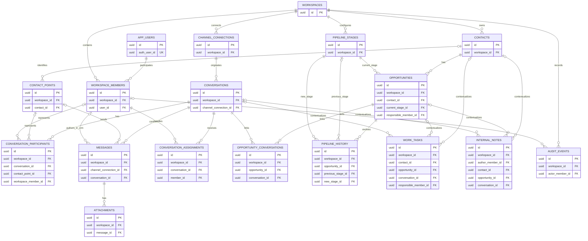

# Modelo lógico do banco de dados do ImobFlux

Status: especificação lógica original da Sprint 9, complementada pelas decisões
executáveis posteriores. O modelo de 18 tabelas permanece preservado.

## 1. Objetivo

Transformar o modelo conceitual aprovado em uma especificação relacional para
PostgreSQL e Supabase. Este documento define tabelas, colunas lógicas,
relacionamentos, nulabilidade, chaves, restrições e índices recomendados, sem
produzir DDL ou antecipar a implementação.

O modelo foi preparado para que uma sprint posterior possa implementar schema,
migrations e RLS sem rediscutir sua estrutura fundamental.

O dimensionamento inicial considera aproximadamente três a cinco funcionários
por workspace. Isso orienta simplicidade e índices, mas não cria limite rígido
de membros no schema.

## 2. Princípios da modelagem

- **Workspace é a fronteira do tenant:** todo registro de negócio possui uma
  ligação inequívoca com um workspace.
- **Colaboração não depende de atribuição:** membros ativos colaboram sobre
  dados comerciais; atribuições representam somente responsabilidade.
- **Privacidade é estrutural e temporal:** proteção atual e marco de liberação
  fazem parte do estado relacional, não apenas da auditoria.
- **Estado atual e histórico são separados:** tabelas operacionais guardam o
  estado corrente; históricos explicam transições.
- **Sem exclusão física funcional:** encerramento, inativação, arquivamento ou
  cancelamento são usados conforme o ciclo da entidade.
- **Integridade antes de conveniência:** relações entre tabelas do tenant devem
  impedir referências cruzadas entre workspaces.
- **Normalização pragmática:** o modelo busca 3FN e BCNF quando úteis, sem EAV,
  abstrações genéricas ou joins criados apenas por formalismo.
- **Dados privados não são caches inocentes:** qualquer projeção derivada deve
  respeitar a mesma regra temporal do conteúdo original.

## 3. Convenções

### 3.1 Nomenclatura

- tabelas e colunas usam `snake_case`;
- tabelas usam plural;
- chaves primárias usam `id`;
- chaves estrangeiras usam `<entidade>_id`;
- instantes usam sufixo `_at`;
- booleanos usam prefixo `is_` quando representam condição atual;
- valores monetários não são incluídos nesta sprint, pois ainda não foram
  aprovados no domínio.

### 3.2 Tipos lógicos

| Tipo lógico | Uso |
| --- | --- |
| `uuid` | Identificadores internos e correlações técnicas |
| `text` | Conteúdo textual e estados controlados por `CHECK` |
| `integer` | Ordem e valores inteiros pequenos |
| `bigint` | Tamanho de arquivo em bytes |
| `boolean` | Condições atuais simples |
| `timestamptz` | Todo instante de negócio ou técnico |
| `jsonb` | Apenas metadados técnicos sanitizados da auditoria |

### 3.3 Nulabilidade

Uma coluna nullable representa ausência válida no domínio. Não será usada para
adiar uma decisão de modelagem. Cada ausência importante é justificada no
catálogo.

### 3.4 Repetição consciente de `workspace_id`

`workspace_id` será armazenado nas tabelas pertencentes ao tenant, mesmo quando
for derivável por outra FK, somente quando cumprir pelo menos uma destas funções:

- permitir RLS direta;
- impedir associação entre workspaces por FK composta;
- reduzir joins em consultas de alto volume;
- facilitar índices iniciados pela fronteira do tenant;
- manter auditoria e históricos autocontidos quanto ao workspace.

As tabelas globais `app_users` e `workspaces` são as únicas sem `workspace_id`.
Cada tabela do tenant terá, além da PK global, uma unicidade de suporte em
`(workspace_id, id)` quando for alvo de FK composta. Essa redundância é
deliberada para garantir integridade entre tenants.

### 3.5 Remoção física futura

As FKs usam conceitualmente `RESTRICT` ou `NO ACTION`. Nenhuma relação de
negócio depende de `CASCADE`. Uma eventual rotina técnica de expurgo deverá
percorrer dependências explicitamente e nunca poderá apagar auditoria de forma
indireta.

## 4. Estratégia de identificadores

Todas as tabelas usam UUID como PK lógica.

Decisão:

- adotar UUID aleatório compatível com PostgreSQL/Supabase;
- não depender de sequências globais;
- não usar a ordenação do UUID para paginação;
- usar timestamp de negócio mais `id` como cursor estável em tabelas de alto
  volume.

UUID v4 é suficiente para o MVP e possui suporte simples. UUID v7 poderá ser
avaliado na implementação se estiver disponível sem extensão não padronizada,
mas não é requisito estrutural.

## 5. Estratégia temporal

- todos os instantes são `timestamptz` e representam UTC no armazenamento;
- fuso do workspace serve para apresentação e regras de calendário;
- `created_at` representa criação interna;
- `updated_at` existe apenas em registros mutáveis;
- históricos append-only não possuem `updated_at`;
- timestamps externos nunca substituem o instante de gravação interna;
- pares como status e timestamp devem permanecer coerentes por `CHECK`.

Em mensagens, `occurred_at` é o instante canônico de ordenação e privacidade:
usa o momento confiável do canal quando existente e o momento interno para
mensagens originadas no CRM. Isso evita que uma mensagem antiga, importada
depois de uma liberação, seja tratada como conteúdo novo.

## 6. Estratégia de estados e enums

O modelo recomenda `text` com `CHECK`, e não PostgreSQL ENUM, para estados
internos. Essa escolha facilita evolução por migration e mantém os valores
visíveis na especificação. Cadastros configuráveis, como etapas do funil, são
tabelas e não enums.

| Domínio lógico | Valores iniciais |
| --- | --- |
| `user_status` | `active`, `inactive` |
| `workspace_status` | `active`, `suspended`, `closed` |
| `membership_role` | `owner`, `attendant` |
| `membership_status` | `invited`, `active`, `suspended`, `removed` |
| `contact_classification` | `person`, `lead`, `client` |
| `contact_operational_status` | `active`, `inactive` |
| `contact_point_type` | `phone`, `external_identifier` |
| `channel_provider` | `whatsapp` |
| `channel_connection_status` | `configured`, `active`, `paused`, `disconnected`, `replaced` |
| `conversation_type` | `individual`, `group` |
| `conversation_status` | `active`, `archived` |
| `conversation_visibility` | `commercial`, `owner_only` |
| `message_direction` | `incoming`, `outgoing` |
| `message_origin` | `crm`, `whatsapp` |
| `message_status` | `received`, `queued`, `sent`, `delivered`, `read`, `failed` |
| `attachment_status` | `pending`, `available`, `unavailable`, `archived` |
| `opportunity_status` | `open`, `won`, `lost` |
| `task_type` | `task`, `follow_up` |
| `task_status` | `pending`, `completed`, `cancelled` |
| `task_priority` | `low`, `normal`, `high`, `urgent` |
| `audit_actor_type` | `member`, `system` |
| `audit_result` | `success`, `denied`, `failed` |

`overdue` não é estado persistido da tarefa: é derivado de `due_at`, status e
instante atual. “Inativo” também não é classificação comercial do contato;
fica em `operational_status`, separado de Pessoa, Lead e Cliente.

## 7. Catálogo resumido de tabelas

| # | Tabela | Papel |
| --- | --- | --- |
| 1 | `app_users` | Identidade interna desacoplada do provedor de autenticação |
| 2 | `workspaces` | Fronteira de tenant e configurações básicas |
| 3 | `workspace_members` | Episódio de vínculo, papel e situação no workspace |
| 4 | `contacts` | Cadastro mestre e proteção da pessoa ou organização |
| 5 | `contact_points` | Telefones e identificadores externos normalizados |
| 6 | `channel_connections` | Conexões de WhatsApp e futuros canais |
| 7 | `conversations` | Thread externa, estado operacional e visibilidade |
| 8 | `conversation_participants` | Participantes atuais da conversa |
| 9 | `messages` | Unidades de comunicação sincronizadas ou enviadas pelo CRM |
| 10 | `attachments` | Metadados de arquivos, separados do armazenamento |
| 11 | `conversation_assignments` | Responsabilidades temporais sobre conversas |
| 12 | `pipeline_stages` | Etapas configuráveis do funil |
| 13 | `opportunities` | Negociações e seu estado atual |
| 14 | `opportunity_conversations` | Associação temporal N:N entre oportunidades e conversas |
| 15 | `pipeline_history` | Histórico append-only das mudanças de etapa |
| 16 | `work_tasks` | Tarefas, follow-ups e lembrete opcional |
| 17 | `internal_notes` | Notas internas ligadas a um contexto explícito |
| 18 | `audit_events` | Auditoria permanente e append-only |

## 8. Catálogo detalhado

### 8.1 `app_users`

**Propósito:** representar a identidade durável do usuário no domínio, sem
usar `auth.users` como registro de negócio.

| Coluna | Tipo | Nulo | Chave ou regra | Justificativa |
| --- | --- | --- | --- | --- |
| `id` | `uuid` | não | PK | Identidade interna preservada mesmo sem Auth |
| `auth_user_id` | `uuid` | sim | UNIQUE parcial | Ausente antes da vinculação futura ao Supabase Auth |
| `display_name` | `text` | não | texto não vazio | Nome usado no produto e em autorias |
| `status` | `text` | não | `user_status` | Situação global da identidade |
| `created_at` | `timestamptz` | não | criação | Registro interno |
| `updated_at` | `timestamptz` | não | atualização | Alterações de nome ou vínculo |
| `deactivated_at` | `timestamptz` | sim | coerente com `inactive` | Ausente enquanto ativo |

**FKs:** `auth_user_id` é apenas referência lógica nesta sprint. Na integração
futura poderá apontar para `auth.users(id)` com comportamento equivalente a
`SET NULL`, nunca `CASCADE`, para preservar autoria histórica.

**UNIQUEs:** `auth_user_id` somente quando não nulo.

**CHECKs:** nome não vazio; status válido; `deactivated_at` obrigatório somente
quando inativo.

**Relacionamentos:** `app_users` 1:N `workspace_members`.

**Índices:** o UNIQUE de `auth_user_id` atende a resolução futura de
`auth.uid()`; nenhum índice de status é necessário no MVP.

**Regra especial:** esta tabela é o próprio conceito User, não um perfil
duplicado. Dados de credencial continuam fora dela.

### 8.2 `workspaces`

**Propósito:** delimitar propriedade, isolamento e configuração básica do
negócio.

| Coluna | Tipo | Nulo | Chave ou regra | Justificativa |
| --- | --- | --- | --- | --- |
| `id` | `uuid` | não | PK | Fronteira do tenant |
| `name` | `text` | não | texto não vazio | Identificação do negócio |
| `status` | `text` | não | `workspace_status` | Estado atual |
| `timezone` | `text` | não | identificador IANA válido | Apresentação e calendário |
| `created_at` | `timestamptz` | não | criação | Ciclo de vida |
| `updated_at` | `timestamptz` | não | atualização | Dados administrativos mutáveis |
| `closed_at` | `timestamptz` | sim | coerente com `closed` | Ausente enquanto não encerrado |

**FKs:** nenhuma.

**UNIQUEs:** não há unicidade de nome; negócios diferentes podem ter o mesmo
nome.

**CHECKs:** nome não vazio; status válido; `closed_at` presente exatamente no
estado fechado; `updated_at >= created_at`.

**Relacionamentos:** Workspace 1:N com todas as tabelas do tenant.

**Índices:** PK; índice por status somente quando rotinas administrativas
globais justificarem.

**Regra especial:** o OWNER não é duplicado nesta tabela. A propriedade é
representada pelo vínculo ativo em `workspace_members`.

### 8.3 `workspace_members`

**Propósito:** representar cada episódio de vínculo de um usuário com um
workspace, incluindo convite, atividade, suspensão e remoção.

| Coluna | Tipo | Nulo | Chave ou regra | Justificativa |
| --- | --- | --- | --- | --- |
| `id` | `uuid` | não | PK | Identidade do episódio de vínculo |
| `workspace_id` | `uuid` | não | FK `workspaces` | Tenant explícito |
| `user_id` | `uuid` | sim | FK `app_users` | Convite pode existir antes do usuário interno |
| `invited_email_normalized` | `text` | sim | UNIQUE parcial de convite | Identifica o destinatário antes do aceite |
| `role` | `text` | não | `membership_role` | Apenas OWNER ou ATTENDANT |
| `status` | `text` | não | `membership_status` | Estado atual do vínculo |
| `invited_by_member_id` | `uuid` | sim | FK autorreferente no workspace | Nulo somente para o primeiro OWNER criado pelo sistema |
| `invited_at` | `timestamptz` | sim | ciclo do convite | Primeiro OWNER não depende de convite |
| `invitation_expires_at` | `timestamptz` | sim | posterior ao convite | Convite pode não possuir expiração até a política futura |
| `activated_at` | `timestamptz` | sim | obrigatório após aceite | Ausente enquanto convidado |
| `suspended_at` | `timestamptz` | sim | obrigatório quando suspenso | Marco da suspensão atual |
| `removed_at` | `timestamptz` | sim | obrigatório quando removido | Preserva desligamento |
| `created_at` | `timestamptz` | não | criação | Registro interno |
| `updated_at` | `timestamptz` | não | atualização | Estado mutável |

**FKs:** workspace obrigatório; usuário nullable; autor do convite nullable e
restrito ao mesmo workspace por FK composta. Todas usam `RESTRICT`; nenhum
desligamento remove a linha.

**UNIQUEs:** uma associação não removida por `(workspace_id, user_id)`; um
convite aberto por `(workspace_id, invited_email_normalized)`; no máximo um
vínculo OWNER não removido por workspace, com reforço específico para OWNER
ativo.

**CHECKs:** usuário ou e-mail precisa identificar o convite; vínculo ativo,
suspenso ou removido exige `user_id`; timestamps precisam corresponder ao
status; papel e status devem pertencer aos domínios aprovados.

**Relacionamentos:** Workspace 1:N membros; User 1:N vínculos; membro é
referenciado como autor ou responsável por várias tabelas.

**Índices:** `(workspace_id, status, role)` para autorização; UNIQUEs parciais
descritos acima; `(user_id, status)` para localizar workspaces ativos.

**Regra especial do OWNER:** índices parciais garantem “no máximo um”. A regra
“pelo menos um OWNER ativo” exige criação atômica do workspace e, futuramente,
validação transacional diferível. Suspender ou remover o OWNER sem substituição
deve ser recusado. Essa estratégia permite transferência futura sem modelá-la
agora.

### 8.4 `contacts`

**Propósito:** armazenar a identidade comercial atual, sua classificação,
estado operacional e proteção.

| Coluna | Tipo | Nulo | Chave ou regra | Justificativa |
| --- | --- | --- | --- | --- |
| `id` | `uuid` | não | PK | Identidade do contato |
| `workspace_id` | `uuid` | não | FK `workspaces` | Isolamento e RLS |
| `display_name` | `text` | não | texto não vazio | Identificação conhecida |
| `classification` | `text` | não | `contact_classification` | Pessoa, Lead ou Cliente |
| `operational_status` | `text` | não | `contact_operational_status` | Ativo ou inativo, separado da classificação |
| `is_protected` | `boolean` | não | padrão falso | Proteção atual aplicada pelo OWNER |
| `commercial_visible_from` | `timestamptz` | sim | corte temporal | Nulo significa que nunca houve corte histórico |
| `protected_at` | `timestamptz` | sim | obrigatório quando protegido | Marco da proteção atual |
| `inactive_at` | `timestamptz` | sim | coerente com status | Ausente enquanto ativo |
| `archived_at` | `timestamptz` | sim | arquivamento funcional | Ausente enquanto participa das listas normais |
| `created_at` | `timestamptz` | não | criação | Ciclo de vida |
| `updated_at` | `timestamptz` | não | atualização | Cadastro mutável |

**FKs:** workspace obrigatório e `RESTRICT`.

**UNIQUEs:** `(workspace_id, id)` dá suporte às FKs compostas. Nome não é único.

**CHECKs:** domínios válidos; nome não vazio; coerência entre status e
`inactive_at`; `protected_at` presente quando protegido; datas não anteriores à
criação.

**Relacionamentos:** Workspace 1:N contatos; Contact 1:N pontos; Contact 1:N
oportunidades; conversas são alcançadas pelos participantes e pontos.

**Índices:** `(workspace_id, archived_at, operational_status)` para listagem;
`(workspace_id, is_protected)` para verificações de privacidade; índice em
`lower(display_name)` dentro do workspace para busca futura.

**Regra temporal:** quando a proteção é removida, `commercial_visible_from`
recebe o instante da liberação. Conversas iniciadas antes dele continuam
privadas; novas conversas podem ser comerciais. Reproteger não apaga o corte
anterior e uma nova liberação o avança.

### 8.5 `contact_points`

**Propósito:** representar telefones e outras identidades externas, mesmo antes
de serem associados a um contato.

| Coluna | Tipo | Nulo | Chave ou regra | Justificativa |
| --- | --- | --- | --- | --- |
| `id` | `uuid` | não | PK | Identidade estável do ponto |
| `workspace_id` | `uuid` | não | FK `workspaces` | Mesmo valor pode existir em outro tenant |
| `contact_id` | `uuid` | sim | FK composta `contacts` | Ponto externo ainda pode estar não identificado |
| `point_type` | `text` | não | `contact_point_type` | Telefone ou identificador futuro |
| `normalized_value` | `text` | não | UNIQUE no workspace e tipo | Identidade usada em matching |
| `display_value` | `text` | sim | apresentação | Pode não existir no primeiro webhook |
| `external_display_name` | `text` | sim | metadado do canal | Nome externo pode ser desconhecido |
| `operational_status` | `text` | não | `active` ou `inactive` | Estado atual |
| `is_protected` | `boolean` | não | padrão falso | Proteção mais restritiva do ponto |
| `commercial_visible_from` | `timestamptz` | sim | corte temporal | Nulo quando nunca houve corte próprio |
| `protected_at` | `timestamptz` | sim | coerente com proteção | Marco atual |
| `inactive_at` | `timestamptz` | sim | coerente com status | Desativação sem exclusão |
| `created_at` | `timestamptz` | não | criação | Ciclo de vida |
| `updated_at` | `timestamptz` | não | atualização | Associação e nome podem mudar |

**FKs:** workspace obrigatório; contato nullable e do mesmo workspace por FK
composta. Remoção lógica do contato não apaga nem desassocia o ponto.

**UNIQUEs:** `(workspace_id, point_type, normalized_value)` em todo o histórico.
Um número é uma única identidade dentro do workspace, mas pode existir em
outros workspaces.

**CHECKs:** valor normalizado não vazio; status válido; coerência de proteção e
inativação; telefone deve usar normalização canônica definida na implementação.

**Relacionamentos:** Contact 1:N pontos; ponto 1:N participantes e pode ser
remetente de muitas mensagens.

**Índices:** o UNIQUE atende busca por telefone; `(workspace_id, contact_id,
operational_status)` atende carregamento dos pontos; `(workspace_id,
is_protected)` auxilia privacidade.

**Regra especial:** a proteção efetiva é `contacts.is_protected OR
contact_points.is_protected`. O ponto só pode tornar o acesso mais restritivo.
Reassociação exige reavaliar e auditar as conversas relacionadas.

### 8.6 `channel_connections`

**Propósito:** representar contas externas conectadas, separando a origem das
conversas do workspace.

| Coluna | Tipo | Nulo | Chave ou regra | Justificativa |
| --- | --- | --- | --- | --- |
| `id` | `uuid` | não | PK | Identidade da conexão |
| `workspace_id` | `uuid` | não | FK `workspaces` | Isolamento explícito |
| `provider` | `text` | não | `channel_provider` | WhatsApp no MVP |
| `external_account_id` | `text` | não | UNIQUE global com provedor | Conta no provedor |
| `external_phone_normalized` | `text` | sim | obrigatório para WhatsApp ativo | Outros canais futuros podem não usar telefone |
| `display_name` | `text` | sim | apresentação | Nome pode chegar depois da configuração |
| `credential_reference` | `text` | sim | referência opaca | Aponta futuramente para cofre seguro, nunca contém segredo |
| `status` | `text` | não | `channel_connection_status` | Estado atual da conexão |
| `activated_at` | `timestamptz` | sim | coerente com ativação | Ausente antes da primeira ativação |
| `paused_at` | `timestamptz` | sim | coerente com pausa | Marco atual da pausa |
| `disconnected_at` | `timestamptz` | sim | coerente com desconexão | Preserva encerramento |
| `created_at` | `timestamptz` | não | criação | Ciclo de vida |
| `updated_at` | `timestamptz` | não | atualização | Estado mutável |

**FKs:** workspace obrigatório e `RESTRICT`.

**UNIQUEs:** `(provider, external_account_id)` em todo o sistema impede que a
mesma fonte externa alimente dois workspaces; no MVP, índice
parcial em `(workspace_id, provider)` quando status ativo garante uma conexão
WhatsApp ativa. Remover esse limite futuramente não exige remodelar relações.

**CHECKs:** domínios válidos; identificador não vazio; telefone obrigatório
para WhatsApp ativo; timestamps coerentes com o estado.

**Relacionamentos:** Workspace 1:N conexões; conexão 1:N conversas e mensagens.

**Índices:** UNIQUEs acima; `(workspace_id, status)` para administração.

**Regra especial:** tokens e credenciais nunca são armazenados nesta tabela.
`credential_reference` somente identifica um segredo em mecanismo seguro
futuro e pode permanecer nulo até a integração.

### 8.7 `conversations`

**Propósito:** representar a thread externa, seu estado operacional e sua
fronteira atual de visibilidade.

| Coluna | Tipo | Nulo | Chave ou regra | Justificativa |
| --- | --- | --- | --- | --- |
| `id` | `uuid` | não | PK | Identidade interna da conversa |
| `workspace_id` | `uuid` | não | FK `workspaces` | RLS e isolamento direto |
| `channel_connection_id` | `uuid` | não | FK composta `channel_connections` | Origem externa inequívoca |
| `external_thread_id` | `text` | não | UNIQUE por conexão | Idempotência da thread |
| `conversation_type` | `text` | não | `conversation_type` | Individual ou grupo |
| `operational_status` | `text` | não | `conversation_status` | Ativa ou arquivada |
| `visibility` | `text` | não | `conversation_visibility` | Comercial ou somente OWNER |
| `commercial_visible_from` | `timestamptz` | sim | corte temporal | Nulo significa que todo o histórico pode ser comercial |
| `subject` | `text` | sim | metadado atual | Conversa individual pode não possuir assunto; grupo pode ter nome |
| `started_at` | `timestamptz` | não | instante canônico da thread | Usado no corte temporal do contato |
| `privacy_changed_at` | `timestamptz` | sim | alteração de visibilidade | Nulo enquanto nunca alterada pelo OWNER |
| `archived_at` | `timestamptz` | sim | coerente com status | Arquivamento sem exclusão |
| `created_at` | `timestamptz` | não | criação interna | Pode ser posterior a `started_at` em importações |
| `updated_at` | `timestamptz` | não | metadados operacionais | Não é atualizado apenas pela chegada de mensagem |

**FKs:** workspace obrigatório; conexão obrigatória e do mesmo workspace por FK
composta. Remoção ou desconexão do canal não apaga conversas.

**UNIQUEs:** `(channel_connection_id, external_thread_id)` impede thread
duplicada; `(workspace_id, channel_connection_id, id)` suporta a FK composta de
mensagens.

**CHECKs:** IDs externos não vazios; domínios válidos; `archived_at` coerente;
datas de mudança não anteriores à criação interna, exceto `started_at`, que pode
ser histórico. Grupo nasce `owner_only` e individual nasce `commercial` como
invariante de criação, mas pode mudar depois e por isso não é um CHECK estático.

**Relacionamentos:** conexão 1:N conversas; conversa 1:N participantes,
mensagens e atribuições; conversa N:N oportunidades pela associação explícita.

**Índices:** UNIQUE externo; `(workspace_id, visibility, operational_status,
created_at DESC, id DESC)` para listas filtradas; `(workspace_id,
commercial_visible_from)` para verificações temporais; `(workspace_id,
archived_at)` para registros ativos.

**Regra temporal:** `owner_only` nega todo acesso de ATTENDANT. Em conversa
comercial, `commercial_visible_from IS NULL` libera todo o conteúdo; quando
preenchido, somente mensagens com `occurred_at` igual ou posterior ao corte são
comerciais. Proteger novamente a conversa muda a visibilidade para
`owner_only`; uma liberação posterior avança o corte.

### 8.8 `conversation_participants`

**Propósito:** representar participantes atuais sem duplicar contatos ou usar
uma FK polimórfica.

| Coluna | Tipo | Nulo | Chave ou regra | Justificativa |
| --- | --- | --- | --- | --- |
| `id` | `uuid` | não | PK | Identidade da participação |
| `workspace_id` | `uuid` | não | FK `workspaces` | Isolamento direto |
| `conversation_id` | `uuid` | não | FK composta `conversations` | Contexto obrigatório |
| `contact_point_id` | `uuid` | sim | FK composta `contact_points` | Participante externo, identificado ou não |
| `workspace_member_id` | `uuid` | sim | FK composta `workspace_members` | Participante interno quando aplicável |
| `external_display_name` | `text` | sim | rótulo atual do canal | Provedor pode não fornecer nome |
| `first_seen_at` | `timestamptz` | não | primeiro instante conhecido | Pode vir do canal |
| `last_seen_at` | `timestamptz` | sim | atividade conhecida | Ausente quando ainda não observada novamente |
| `left_at` | `timestamptz` | sim | fim da participação atual | Nulo enquanto ativo |
| `created_at` | `timestamptz` | não | criação interna | Rastreabilidade |
| `updated_at` | `timestamptz` | não | estado atual | Nome e presença podem mudar |

**FKs:** conversa obrigatória; exatamente um entre ponto de contato e membro,
sempre no mesmo workspace. FKs usam `RESTRICT`.

**UNIQUEs:** um participante externo ativo por `(conversation_id,
contact_point_id)` e um participante interno ativo por `(conversation_id,
workspace_member_id)`, ambos por índices parciais onde `left_at` é nulo.

**CHECKs:** exatamente uma das duas FKs de identidade deve estar preenchida;
`left_at >= first_seen_at`; `last_seen_at >= first_seen_at` quando presente.

**Relacionamentos:** conversa 1:N participantes; ponto e membro 1:N
participações.

**Índices:** `(workspace_id, conversation_id, left_at)` para carregar a lista
atual; `(workspace_id, contact_point_id, left_at)` para localizar conversas do
ponto; índice equivalente para membro.

**Regra especial:** participante externo ainda não identificado usa um
`contact_point` com `contact_id` nulo. O modelo não cria `target_type +
target_id`. Esta tabela guarda o estado atual, não um histórico completo de
entradas e saídas. Após liberação, metadados atuais podem ser projetados, mas
eventos históricos anteriores ao corte não são inferidos desta tabela.

### 8.9 `messages`

**Propósito:** armazenar mensagens com origem, direção, autoria e chaves de
idempotência independentes.

| Coluna | Tipo | Nulo | Chave ou regra | Justificativa |
| --- | --- | --- | --- | --- |
| `id` | `uuid` | não | PK | Identidade local |
| `workspace_id` | `uuid` | não | FK `workspaces` | RLS sem depender de cadeia longa |
| `channel_connection_id` | `uuid` | não | FK composta | Upsert por conexão e mensagem externa |
| `conversation_id` | `uuid` | não | FK composta `conversations` | Thread obrigatória |
| `external_message_id` | `text` | sim | UNIQUE parcial por conexão | Ausente enquanto envio CRM ainda não recebeu ID externo |
| `client_idempotency_key` | `uuid` | sim | UNIQUE parcial por workspace | Obrigatória para criação originada no CRM |
| `direction` | `text` | não | `message_direction` | Incoming ou outgoing |
| `origin` | `text` | não | `message_origin` | CRM ou WhatsApp |
| `sender_contact_point_id` | `uuid` | sim | FK composta `contact_points` | Obrigatório para entrada externa identificável |
| `internal_author_member_id` | `uuid` | sim | FK composta `workspace_members` | Somente mensagem criada no CRM possui autor interno |
| `text_content` | `text` | sim | conteúdo | Mensagem somente com anexo é válida |
| `status` | `text` | não | `message_status` | Situação normalizada de entrega |
| `occurred_at` | `timestamptz` | não | instante canônico | Ordenação, cursor e privacidade temporal |
| `external_created_at` | `timestamptz` | sim | momento do provedor | Ausente antes do reconhecimento externo do envio CRM |
| `received_at` | `timestamptz` | sim | recepção do webhook/importação | Não se aplica à criação local ainda não sincronizada |
| `status_updated_at` | `timestamptz` | sim | última mudança de entrega | Ausente quando ainda não houve atualização posterior |
| `created_at` | `timestamptz` | não | inserção interna | Rastreabilidade técnica |

**FKs:** workspace, conexão e conversa obrigatórios; FK composta garante que a
conversa pertence à mesma conexão e workspace. Remetente e autor são nullable,
mas, quando presentes, pertencem ao mesmo workspace. Todas usam `RESTRICT`.

**UNIQUEs:** `(channel_connection_id, external_message_id)` quando o ID externo
não é nulo; `(workspace_id, client_idempotency_key)` quando a chave local não é
nula; `(workspace_id, id)` para herança segura por anexos.

**CHECKs:** valores de direção, origem e status válidos; origem CRM exige
`outgoing`, autor interno e chave local; origem WhatsApp não admite autor
interno presumido e exige ID externo, timestamp externo e `received_at`;
mensagem incoming exige remetente externo e status `received`; mensagem
outgoing admite `queued`, `sent`, `delivered`, `read` ou `failed`; datas externas
e internas precisam ser coerentes sem exigir que sejam iguais.

**Relacionamentos:** conversa 1:N mensagens; conexão 1:N mensagens; ponto 1:N
mensagens enviadas; membro 1:N mensagens criadas no CRM; mensagem 1:N anexos.

**Índices:** `(workspace_id, conversation_id, occurred_at DESC, id DESC)` para
histórico e keyset; UNIQUE externo para webhooks; UNIQUE local para retries do
CRM; `(workspace_id, status, status_updated_at)` parcial para envios ainda não
finalizados.

**Regra especial:** `text_content` pode ser nulo porque o anexo é inserido em
outra tabela. A invariável “texto ou ao menos um anexo” deverá ser validada na
transação de aplicação ou por mecanismo diferível futuro, não por FK
polimórfica nem por conteúdo artificial.

### 8.10 `attachments`

**Propósito:** guardar metadados e referência segura de armazenamento sem URL
pública permanente.

| Coluna | Tipo | Nulo | Chave ou regra | Justificativa |
| --- | --- | --- | --- | --- |
| `id` | `uuid` | não | PK | Identidade do anexo |
| `workspace_id` | `uuid` | não | FK `workspaces` | RLS e storage por tenant |
| `message_id` | `uuid` | não | FK composta `messages` | Privacidade herdada |
| `storage_bucket` | `text` | não | parte da UNIQUE | Bucket privado |
| `storage_key` | `text` | não | parte da UNIQUE | Chave opaca, nunca URL pública |
| `original_file_name` | `text` | não | nome sanitizado | Apresentação sem caminho local |
| `mime_type` | `text` | não | formato declarado/validado | Metadado mínimo do arquivo |
| `size_bytes` | `bigint` | não | positivo | Limites e integridade |
| `sha256` | `text` | sim | formato hexadecimal | Pode ser calculado após o recebimento |
| `status` | `text` | não | `attachment_status` | Estado do metadado/objeto |
| `created_at` | `timestamptz` | não | criação | Registro interno |
| `available_at` | `timestamptz` | sim | coerente com disponível | Ausente enquanto transferência incompleta |
| `archived_at` | `timestamptz` | sim | coerente com arquivado | Sem exclusão física funcional |

**FKs:** mensagem obrigatória e do mesmo workspace por FK composta. A FK usa
`RESTRICT`, inclusive se o objeto de storage ficar indisponível.

**UNIQUEs:** `(storage_bucket, storage_key)`; `(workspace_id, id)` para futuras
referências seguras.

**CHECKs:** textos não vazios; tamanho positivo; hash válido quando presente;
status e timestamps coerentes.

**Relacionamentos:** Message 1:N Attachment.

**Índices:** `(workspace_id, message_id, created_at)` para carregar anexos;
UNIQUE da chave de storage; índice parcial por status pendente apenas quando a
integração precisar recuperar transferências incompletas.

**Regra especial:** acesso sempre é resolvido pela mensagem e conversa,
incluindo `commercial_visible_from`. `storage_key` nunca é apresentado como URL
pública; acesso futuro usa autorização e URL temporária.

### 8.11 `conversation_assignments`

**Propósito:** representar atribuições atuais e seu histórico temporal numa
única relação append-oriented.

| Coluna | Tipo | Nulo | Chave ou regra | Justificativa |
| --- | --- | --- | --- | --- |
| `id` | `uuid` | não | PK | Identidade da atribuição |
| `workspace_id` | `uuid` | não | FK `workspaces` | Isolamento explícito |
| `conversation_id` | `uuid` | não | FK composta `conversations` | Conversa atribuída |
| `member_id` | `uuid` | não | FK composta `workspace_members` | Responsável operacional |
| `assigned_by_member_id` | `uuid` | não | FK composta `workspace_members` | Autor da atribuição |
| `ended_by_member_id` | `uuid` | sim | FK composta `workspace_members` | Ausente enquanto ativa ou quando encerrada pelo sistema |
| `assigned_at` | `timestamptz` | não | início | Estado temporal |
| `ended_at` | `timestamptz` | sim | fim | Nulo identifica atribuição atual |
| `end_reason` | `text` | sim | motivo sanitizado | Ausente enquanto ativa ou quando não informado |

**FKs:** conversa, responsável e autor obrigatórios; autor do encerramento
nullable. Todos pertencem ao mesmo workspace e usam `RESTRICT`.

**UNIQUEs:** `(conversation_id, member_id)` onde `ended_at IS NULL`, impedindo
duas atribuições atuais iguais.

**CHECKs:** `ended_at >= assigned_at`; motivo e autor de encerramento somente
quando encerrada; membro atribuído precisa estar ativo como invariável da
operação, pois status em outra tabela não cabe em CHECK local.

**Relacionamentos:** Conversation N:N WorkspaceMember ao longo do tempo.

**Índices:** `(workspace_id, conversation_id, ended_at)` para responsáveis
atuais; `(workspace_id, member_id, ended_at, assigned_at DESC)` para carga de
trabalho e histórico.

**Regra especial:** atribuição nunca entra nas condições de RLS comercial. Uma
única tabela temporal evita duplicar “estado atual” e “histórico”; o estado
atual é o subconjunto com `ended_at` nulo. A restauração após reativação
permanece decisão adiada.

### 8.12 `pipeline_stages`

**Propósito:** definir etapas configuráveis e ordenadas dentro de cada
workspace.

| Coluna | Tipo | Nulo | Chave ou regra | Justificativa |
| --- | --- | --- | --- | --- |
| `id` | `uuid` | não | PK | Identidade durável da etapa |
| `workspace_id` | `uuid` | não | FK `workspaces` | Funil por tenant |
| `name` | `text` | não | UNIQUE ativa por nome normalizado | Rótulo configurável |
| `position` | `integer` | não | UNIQUE ativa | Ordem atual |
| `is_active` | `boolean` | não | condição atual | Desativação preserva FKs históricas |
| `commercial_meaning` | `text` | sim | descrição curta | Significado pode ainda não ter sido detalhado |
| `created_at` | `timestamptz` | não | criação | Ciclo de vida |
| `updated_at` | `timestamptz` | não | alteração | Nome e ordem são mutáveis |
| `deactivated_at` | `timestamptz` | sim | coerente com inativa | Preserva marco de desativação |

**FKs:** workspace obrigatório e `RESTRICT`.

**UNIQUEs:** posição por workspace entre etapas ativas; nome normalizado por
workspace entre etapas ativas. Etapas inativas podem preservar nome e posição
históricos sem bloquear uma configuração nova.

**CHECKs:** posição positiva; nome não vazio; coerência entre `is_active` e
`deactivated_at`.

**Relacionamentos:** Workspace 1:N etapas; etapa 1:N oportunidades como etapa
atual; etapa 1:N ocorrências anteriores ou novas no histórico.

**Índices:** `(workspace_id, is_active, position)` para Kanban; UNIQUEs parciais
de nome normalizado e posição.

**Regra especial:** mover oportunidade para etapa inativa deve ser recusado na
operação futura; manter oportunidade já encerrada ou histórico apontando para
etapa inativa é válido.

### 8.13 `opportunities`

**Propósito:** representar a negociação e seu estado comercial atual sem
duplicar contato ou histórico de etapa.

| Coluna | Tipo | Nulo | Chave ou regra | Justificativa |
| --- | --- | --- | --- | --- |
| `id` | `uuid` | não | PK | Identidade da oportunidade |
| `workspace_id` | `uuid` | não | FK `workspaces` | Isolamento e RLS |
| `contact_id` | `uuid` | não | FK composta `contacts` | Oportunidade sempre pertence a contato |
| `current_stage_id` | `uuid` | não | FK composta `pipeline_stages` | Estado atual não depende do histórico |
| `responsible_member_id` | `uuid` | sim | FK composta `workspace_members` | Oportunidade pode estar sem responsável |
| `title` | `text` | não | texto não vazio | Contexto comercial mínimo |
| `description` | `text` | sim | contexto adicional | Ausência é válida no início da negociação |
| `status` | `text` | não | `opportunity_status` | Aberta, ganha ou perdida |
| `sort_order` | `bigint` | não | posição na etapa | Ordenação persistente do Kanban |
| `created_at` | `timestamptz` | não | criação | Ciclo de vida |
| `updated_at` | `timestamptz` | não | atualização semântica | Não muda por renumeração isolada |
| `closed_at` | `timestamptz` | sim | coerente com ganha/perdida | Ausente enquanto aberta ou apenas arquivada |
| `archived_at` | `timestamptz` | sim | arquivamento independente | Arquivamento funcional sem alterar o resultado |

**FKs:** workspace, contato e etapa obrigatórios; responsável nullable. Todas
as referências pertencem ao mesmo workspace por FKs compostas e usam
`RESTRICT`.

**UNIQUEs:** não existe chave natural aprovada. `(workspace_id, id)` é apenas
suporte de integridade.

**CHECKs:** título não vazio; status válido; `closed_at` obrigatório para ganha
ou perdida e ausente enquanto aberta; `archived_at`, quando presente, não pode
ser anterior à criação; datas não anteriores à criação.

**Relacionamentos:** Contact 1:N oportunidades; PipelineStage 1:N oportunidades
atuais; membro 1:N responsabilidades; Opportunity N:N Conversation;
Opportunity 1:N PipelineHistory.

**Índices:** `(workspace_id, current_stage_id, status, archived_at, sort_order, id)` para
Kanban; `(workspace_id, responsible_member_id, status)` para carga de trabalho;
`(workspace_id, contact_id, created_at DESC)` para histórico do contato;
`(workspace_id, archived_at)` para filtrar ativas.

**Regra especial:** proteção do contato restringe a oportunidade, mas criar ou
assumir a oportunidade não concede acesso às conversas privadas associadas.
Valores monetários e imóveis não são incluídos antes de aprovação específica.

### 8.14 `opportunity_conversations`

**Propósito:** materializar o relacionamento N:N aprovado entre oportunidades
e conversas, preservando vínculo e desvínculo sem delete físico.

| Coluna | Tipo | Nulo | Chave ou regra | Justificativa |
| --- | --- | --- | --- | --- |
| `id` | `uuid` | não | PK | Identidade da associação temporal |
| `workspace_id` | `uuid` | não | FK `workspaces` | Impede associação entre tenants |
| `opportunity_id` | `uuid` | não | FK composta `opportunities` | Negociação relacionada |
| `conversation_id` | `uuid` | não | FK composta `conversations` | Conversa relacionada |
| `linked_by_member_id` | `uuid` | não | FK composta `workspace_members` | Autor do vínculo |
| `unlinked_by_member_id` | `uuid` | sim | FK composta `workspace_members` | Ausente enquanto ativa |
| `linked_at` | `timestamptz` | não | início | Histórico do relacionamento |
| `unlinked_at` | `timestamptz` | sim | fim | Nulo enquanto ativa |

**FKs:** oportunidade, conversa e autor obrigatórios; autor do desvínculo
nullable. Todos no mesmo workspace e com `RESTRICT`.

**UNIQUEs:** `(opportunity_id, conversation_id)` onde `unlinked_at IS NULL`.

**CHECKs:** `unlinked_at >= linked_at`; autor de desvínculo somente quando o
fim existe.

**Relacionamentos:** tabela associativa de Opportunity N:N Conversation.

**Índices:** `(workspace_id, opportunity_id, unlinked_at)` e `(workspace_id,
conversation_id, unlinked_at)`.

**Regra especial:** a associação não amplia acesso. Uma oportunidade comercial
pode apontar para conversa privada sem expor sua existência ao ATTENDANT.

### 8.15 `pipeline_history`

**Propósito:** registrar de forma append-only cada mudança da etapa atual da
oportunidade.

| Coluna | Tipo | Nulo | Chave ou regra | Justificativa |
| --- | --- | --- | --- | --- |
| `id` | `uuid` | não | PK | Identidade do evento comercial |
| `workspace_id` | `uuid` | não | FK `workspaces` | Histórico autocontido no tenant |
| `opportunity_id` | `uuid` | não | FK composta `opportunities` | Oportunidade alterada |
| `previous_stage_id` | `uuid` | sim | FK composta `pipeline_stages` | Nulo somente no primeiro registro |
| `new_stage_id` | `uuid` | não | FK composta `pipeline_stages` | Destino da transição |
| `changed_by_member_id` | `uuid` | não | FK composta `workspace_members` | Ator aprovado para a mudança |
| `reason` | `text` | sim | justificativa opcional | Produto não exige motivo em toda mudança |
| `changed_at` | `timestamptz` | não | instante do evento | Cursor e ordem histórica |

**FKs:** oportunidade, nova etapa e ator obrigatórios; etapa anterior nullable
no primeiro evento. Todas pertencem ao mesmo workspace e usam `RESTRICT`.

**UNIQUEs:** nenhum conjunto de valores de negócio é necessariamente único;
eventos legítimos podem repetir etapas em momentos diferentes.

**CHECKs:** etapa anterior, quando presente, deve ser diferente da nova etapa;
texto de motivo não pode ser vazio quando fornecido.

**Relacionamentos:** Opportunity 1:N PipelineHistory; PipelineStage 1:N como
origem e 1:N como destino; membro 1:N mudanças.

**Índices:** `(workspace_id, opportunity_id, changed_at DESC, id DESC)` para
keyset; `(workspace_id, new_stage_id, changed_at DESC)` para análises futuras.

**Regra especial:** inserir o histórico e atualizar
`opportunities.current_stage_id` formam uma única transação. A linha histórica
nunca é editada nem arquivada e não contém snapshot da oportunidade.

### 8.16 `work_tasks`

**Propósito:** representar tarefas e follow-ups com um responsável atual,
lembrete opcional e contextos relacionais explícitos.

| Coluna | Tipo | Nulo | Chave ou regra | Justificativa |
| --- | --- | --- | --- | --- |
| `id` | `uuid` | não | PK | Identidade da tarefa |
| `workspace_id` | `uuid` | não | FK `workspaces` | Isolamento e RLS |
| `task_type` | `text` | não | `task_type` | Tarefa comum ou follow-up |
| `title` | `text` | não | texto não vazio | Ação curta e identificável |
| `description` | `text` | sim | detalhe opcional | Título pode ser suficiente |
| `status` | `text` | não | `task_status` | Estado atual |
| `priority` | `text` | não | `task_priority` | Ordenação operacional |
| `due_at` | `timestamptz` | não | prazo | Parte essencial da tarefa aprovada |
| `reminder_at` | `timestamptz` | sim | configuração única | Lembrete pode não ser desejado |
| `responsible_member_id` | `uuid` | sim | FK composta `workspace_members` | Tarefa pode estar sem responsável |
| `contact_id` | `uuid` | sim | FK composta `contacts` | Contexto explícito opcional |
| `opportunity_id` | `uuid` | sim | FK composta `opportunities` | Contexto explícito opcional |
| `conversation_id` | `uuid` | sim | FK composta `conversations` | Contexto explícito opcional |
| `created_by_member_id` | `uuid` | não | FK composta `workspace_members` | Autoria da criação |
| `completed_by_member_id` | `uuid` | sim | FK composta `workspace_members` | Somente quando concluída |
| `cancelled_by_member_id` | `uuid` | sim | FK composta `workspace_members` | Somente quando cancelada |
| `created_at` | `timestamptz` | não | criação | Ciclo de vida |
| `updated_at` | `timestamptz` | não | atualização | Estado e prazo mutáveis |
| `completed_at` | `timestamptz` | sim | coerente com concluída | Ausente nos demais estados |
| `cancelled_at` | `timestamptz` | sim | coerente com cancelada | Ausente nos demais estados |
| `archived_at` | `timestamptz` | sim | arquivamento independente | Preserva se a tarefa estava pendente, concluída ou cancelada |

**FKs:** workspace e autor obrigatórios; responsável e os três contextos são
nullable. Toda FK de negócio inclui workspace e usa `RESTRICT`.

**UNIQUEs:** não há chave natural. `(workspace_id, id)` suporta integridade
composta.

**CHECKs:** ao menos uma entre `contact_id`, `opportunity_id` e
`conversation_id` deve estar preenchida; domínios válidos; título não vazio;
timestamps de conclusão e cancelamento coerentes com o status; `archived_at`
independente e não anterior à criação; responsáveis de transição presentes nos
respectivos estados; `reminder_at` anterior ou igual a `due_at` quando
informado.

**Relacionamentos:** cada contexto 1:N tarefas; membro 1:N tarefas responsáveis
e 1:N ações de ciclo.

**Índices:** `(workspace_id, status, due_at, priority, id)` para prioridades;
`(workspace_id, responsible_member_id, status, due_at)` para trabalho pessoal;
índices parciais em cada contexto quando não nulo; `(workspace_id, archived_at)`.

**Regra especial:** o acesso efetivo é a interseção das restrições dos contextos
preenchidos. Se qualquer conversa relacionada for privada, a tarefa não pode
vazar. Quando `opportunity_id` já identifica o contato, `contact_id` só deve ser
preenchido se o contato for também um contexto intencional, evitando redundância
acidental. `overdue` é derivado, não persistido.

### 8.17 `internal_notes`

**Propósito:** guardar notas humanas internas com autoria durável e exatamente
um contexto principal.

| Coluna | Tipo | Nulo | Chave ou regra | Justificativa |
| --- | --- | --- | --- | --- |
| `id` | `uuid` | não | PK | Identidade da nota |
| `workspace_id` | `uuid` | não | FK `workspaces` | Isolamento e RLS |
| `author_member_id` | `uuid` | não | FK composta `workspace_members` | Autoria nunca é transferida |
| `content` | `text` | não | texto não vazio | Conteúdo da nota |
| `contact_id` | `uuid` | sim | FK composta `contacts` | Um dos contextos possíveis |
| `opportunity_id` | `uuid` | sim | FK composta `opportunities` | Um dos contextos possíveis |
| `conversation_id` | `uuid` | sim | FK composta `conversations` | Um dos contextos possíveis |
| `created_at` | `timestamptz` | não | criação | Autoria temporal |
| `updated_at` | `timestamptz` | não | última edição | Nota é editável e auditada |
| `archived_at` | `timestamptz` | sim | arquivamento | Substitui remoção funcional |

**FKs:** workspace e autor obrigatórios; exatamente uma FK de contexto é
preenchida. Todas pertencem ao mesmo workspace e usam `RESTRICT`.

**UNIQUEs:** não há chave natural.

**CHECKs:** conteúdo não vazio; exatamente uma entre as três FKs de contexto;
`updated_at >= created_at`; `archived_at` não anterior à criação.

**Relacionamentos:** cada contexto 1:N notas; membro 1:N notas autoradas.

**Índices:** índices parciais `(workspace_id, <contexto>_id, archived_at,
created_at DESC)` para cada FK não nula; `(workspace_id, author_member_id,
created_at DESC)` somente se consultas por autoria forem necessárias.

**Regra especial:** a nota herda integralmente a privacidade de seu único
contexto. Edição por outro membro não altera `author_member_id`; ator e mudança
são registrados em auditoria.

### 8.18 `audit_events`

**Propósito:** registrar ações relevantes de forma permanente, append-only e
sem copiar conteúdo dos alvos.

| Coluna | Tipo | Nulo | Chave ou regra | Justificativa |
| --- | --- | --- | --- | --- |
| `id` | `uuid` | não | PK | Identidade do evento |
| `workspace_id` | `uuid` | não | FK `workspaces` | Consulta e RLS OWNER-only |
| `actor_type` | `text` | não | `audit_actor_type` | Membro ou sistema |
| `actor_member_id` | `uuid` | sim | FK composta `workspace_members` | Nulo para ação do sistema |
| `action` | `text` | não | vocabulário controlado pela aplicação | Evolui sem enum rígido |
| `target_type` | `text` | não | tipo lógico do alvo | Necessário porque alvos são heterogêneos |
| `target_id` | `uuid` | sim | sem FK polimórfica | Falha pode ocorrer antes da criação de um alvo |
| `result` | `text` | não | `audit_result` | Sucesso, negação ou falha |
| `correlation_id` | `uuid` | sim | correlação técnica | Ausente em ações sem fluxo distribuído |
| `metadata` | `jsonb` | não | objeto sanitizado, padrão vazio | Somente contexto técnico mínimo |
| `occurred_at` | `timestamptz` | não | instante da ação | Cursor e investigação |
| `recorded_at` | `timestamptz` | não | instante da gravação | Pode diferir em processamento assíncrono |

**FKs:** workspace obrigatório; membro nullable e do mesmo workspace. Não há FK
para o alvo por decisão consciente. FKs existentes usam `RESTRICT` e os eventos
nunca são removidos em cascata.

**UNIQUEs:** somente PK. `correlation_id` não é único porque um fluxo pode gerar
vários eventos.

**CHECKs:** ator do tipo membro exige `actor_member_id`; ator sistema exige nulo;
ação e tipo do alvo não vazios; resultado válido; metadata deve ser objeto;
`recorded_at >= occurred_at` quando os relógios pertencem ao mesmo sistema,
admitindo tolerância definida na implementação.

**Relacionamentos:** Workspace 1:N eventos; membro 1:N eventos como ator. Alvos
são referências lógicas e não relacionamentos com integridade FK.

**Índices:** `(workspace_id, occurred_at DESC, id DESC)` para keyset;
`(workspace_id, target_type, target_id, occurred_at DESC)` para investigação;
`(workspace_id, actor_member_id, occurred_at DESC)` quando ator não nulo;
`(workspace_id, correlation_id)` parcial quando correlação existir.

**Regra especial:** não possui `updated_at`, status de arquivamento ou delete.
`metadata` não pode conter corpo de mensagem, conteúdo de nota, arquivo,
miniatura, token, segredo, URL pública ou cópia desnecessária de dados pessoais.
Visualizações simples não geram evento no MVP.

## 9. Relacionamentos globais

| Origem | Cardinalidade | Destino | Implementação lógica |
| --- | --- | --- | --- |
| `app_users` | 1:N | `workspace_members` | `workspace_members.user_id` nullable até aceite |
| `workspaces` | 1:N | `workspace_members` | FK obrigatória |
| `workspaces` | 1:N | todas as tabelas do tenant | `workspace_id` explícito |
| `contacts` | 1:N | `contact_points` | ponto pode ainda não possuir contato |
| `channel_connections` | 1:N | `conversations` | conversa pertence a uma conexão |
| `conversations` | 1:N | `conversation_participants` | participantes atuais |
| `contact_points` | 1:N | `conversation_participants` | participante externo identificado ou não |
| `workspace_members` | 1:N | `conversation_participants` | participante interno opcional |
| `conversations` | 1:N | `messages` | thread obrigatória |
| `messages` | 1:N | `attachments` | privacidade herdada |
| `conversations` | N:N | `workspace_members` | via `conversation_assignments` temporal |
| `contacts` | 1:N | `opportunities` | contato obrigatório |
| `pipeline_stages` | 1:N | `opportunities` | etapa atual |
| `opportunities` | N:N | `conversations` | via `opportunity_conversations` |
| `opportunities` | 1:N | `pipeline_history` | evolução da etapa |
| `pipeline_stages` | 1:N | `pipeline_history` | duas FKs: anterior e nova |
| `contacts` | 1:N | `work_tasks` | contexto opcional |
| `opportunities` | 1:N | `work_tasks` | contexto opcional |
| `conversations` | 1:N | `work_tasks` | contexto opcional |
| `contacts` | 1:N | `internal_notes` | exatamente um dos contextos |
| `opportunities` | 1:N | `internal_notes` | exatamente um dos contextos |
| `conversations` | 1:N | `internal_notes` | exatamente um dos contextos |
| `workspace_members` | 1:N | autorias e responsabilidades | FKs específicas, nunca propriedade exclusiva |
| `workspaces` | 1:N | `audit_events` | alvo lógico não possui FK polimórfica |

Contato e conversa não recebem uma associação adicional. O contato de uma
conversa é alcançado por `conversation_participants.contact_point_id` e
`contact_points.contact_id`. Isso preserva uma única fonte para identidade
externa e permite participantes ainda não identificados. Reassociações são
auditadas e precisam recalcular proteção, mas não reescrevem mensagens.

## 10. Diagrama ER

O diagrama apresenta PKs, FKs principais e cardinalidades. Campos de estado e
índices foram omitidos para manter legibilidade.

## 11. Estratégia de índices

Os índices abaixo respondem a consultas previstas. PKs e UNIQUEs já criam seus
índices correspondentes; não devem ser duplicados.

| Tabela | Colunas ou condição | Motivo |
| --- | --- | --- |
| `app_users` | `auth_user_id`, parcial não nulo | Resolver identidade do Auth |
| `workspace_members` | `(workspace_id, status, role)` | Verificar vínculo ativo e OWNER |
| `workspace_members` | `(user_id, status)` | Listar workspaces acessíveis ao usuário |
| `workspace_members` | UNIQUEs parciais de vínculo atual, convite e OWNER | Evitar duplicidade e múltiplos proprietários |
| `contacts` | `(workspace_id, archived_at, operational_status)` | Listar contatos ativos |
| `contacts` | `(workspace_id, is_protected)` | Verificação de privacidade |
| `contacts` | `(workspace_id, lower(display_name))` | Igualdade e ordenação normalizada por nome; busca parcial exige estratégia futura |
| `contact_points` | UNIQUE `(workspace_id, point_type, normalized_value)` | Buscar telefone e evitar duplicidade |
| `contact_points` | `(workspace_id, contact_id, operational_status)` | Carregar números do contato |
| `channel_connections` | UNIQUE global `(provider, external_account_id)` | Impedir a mesma fonte em dois workspaces |
| `channel_connections` | UNIQUE parcial da conexão ativa por provedor | Limite do MVP |
| `conversations` | UNIQUE `(channel_connection_id, external_thread_id)` | Evitar thread duplicada |
| `conversations` | `(workspace_id, visibility, operational_status, created_at DESC, id DESC)` | Listar conversas acessíveis |
| `conversations` | `(workspace_id, commercial_visible_from)` | Resolver corte temporal |
| `conversation_participants` | `(workspace_id, conversation_id, left_at)` | Participantes atuais |
| `conversation_participants` | `(workspace_id, contact_point_id, left_at)` | Conversas de um ponto/contato |
| `messages` | `(workspace_id, conversation_id, occurred_at DESC, id DESC)` | Histórico paginado e última mensagem visível |
| `messages` | UNIQUE parcial da mensagem externa | Idempotência de webhook e importação |
| `messages` | UNIQUE parcial da chave local | Idempotência de envio CRM |
| `messages` | `(workspace_id, status, status_updated_at)`, parcial em estados não finais | Retentar ou reconciliar entrega |
| `attachments` | `(workspace_id, message_id, created_at)` | Carregar anexos da mensagem |
| `conversation_assignments` | `(workspace_id, conversation_id, ended_at)` | Responsáveis atuais e histórico |
| `conversation_assignments` | `(workspace_id, member_id, ended_at, assigned_at DESC)` | Carga por membro |
| `pipeline_stages` | `(workspace_id, is_active, position)` | Ordenar o Kanban |
| `opportunities` | `(workspace_id, current_stage_id, status, archived_at, sort_order, id)` | Colunas do Kanban |
| `opportunities` | `(workspace_id, responsible_member_id, status)` | Oportunidades por responsável |
| `opportunities` | `(workspace_id, contact_id, created_at DESC)` | Negociações do contato |
| `opportunity_conversations` | índices ativos por oportunidade e conversa | Navegar a associação N:N |
| `pipeline_history` | `(workspace_id, opportunity_id, changed_at DESC, id DESC)` | Histórico por keyset |
| `work_tasks` | `(workspace_id, status, due_at, priority, id)` | Prioridades e tarefas pendentes |
| `work_tasks` | `(workspace_id, responsible_member_id, status, due_at)` | Trabalho por responsável |
| `internal_notes` | índices parciais por cada contexto e `created_at DESC` | Notas do registro sem varrer nulos |
| `audit_events` | `(workspace_id, occurred_at DESC, id DESC)` | Auditoria cronológica por keyset |
| `audit_events` | `(workspace_id, target_type, target_id, occurred_at DESC)` | Investigar um alvo |

### 11.1 Paginação

`messages`, `pipeline_history` e `audit_events` usam keyset com o par
`(<timestamp> DESC, id DESC)`. O cursor inclui ambos os valores. OFFSET fica
restrito a coleções pequenas e administrativas, pois degrada e pode repetir ou
pular linhas sob escrita concorrente.

### 11.2 Conversas recentes

O MVP não armazena `last_message_at` nem `last_message_id`. A última mensagem
visível é obtida pelo índice de mensagens e pelo corte temporal. Isso evita que
um cache global revele o horário de uma mensagem privada numa conversa recém
liberada. Se medições reais demonstrarem gargalo, uma projeção transacional e
segura por visibilidade poderá ser adicionada sem mudar as relações centrais.

## 12. Estratégia de integridade referencial

### 12.1 Fronteira do workspace

As relações críticas usam FKs compostas, por exemplo:

- participante para conversa e ponto;
- mensagem para conversa e conexão;
- anexo para mensagem;
- atribuição para conversa e membros;
- oportunidade para contato, etapa e responsável;
- histórico para oportunidade, etapas e membro;
- tarefa e nota para seus contextos.

O objetivo é tornar impossível inserir uma FK válida cujo registro pertença a
outro workspace. As constraints `(workspace_id, id)` nos pais existem para essa
finalidade, embora `id` já seja globalmente único.

### 12.2 Comportamento de FK

- `RESTRICT/NO ACTION` é o padrão para dados de negócio;
- inativar ou arquivar o pai não altera automaticamente o filho;
- remover vínculo de membro nunca apaga autorias;
- desativar etapa não apaga oportunidades encerradas ou histórico;
- desconectar canal não apaga conversas ou mensagens;
- tornar objeto de storage indisponível não apaga metadados do anexo;
- futura remoção de `auth.users` pode apenas limpar a referência externa em
  `app_users`, preservando a identidade interna.

### 12.3 Invariantes que excedem um CHECK local

Algumas regras exigem transação, validação diferível ou trigger futuro, mas não
alteram o modelo:

- workspace deve terminar cada transação com exatamente um OWNER ativo;
- membro atribuído ou responsável deve estar ativo no momento da ação;
- etapa de destino precisa estar ativa para uma nova movimentação;
- primeiro histórico pode ter etapa anterior nula; os seguintes precisam
  corresponder ao estado anterior da oportunidade;
- atualização de etapa atual e inserção no histórico são atômicas;
- mensagem deve ter texto ou ao menos um anexo ao finalizar sua criação;
- conversa individual deve possuir identidade externa adequada e grupo pode
  possuir vários participantes;
- mudanças de proteção precisam reavaliar conversas e projeções relacionadas.

Nenhum SQL de trigger é definido nesta sprint.

## 13. Estratégia de estado atual e históricos

- `opportunities.current_stage_id` é a fonte do estado atual;
  `pipeline_history` explica a evolução.
- `conversation_assignments` usa intervalo temporal. O subconjunto com
  `ended_at` nulo é o estado atual; linhas encerradas são o histórico.
- `workspace_members.status`, `contacts.operational_status`, estados de tarefas
  e oportunidades permanecem nas tabelas operacionais.
- auditoria não substitui histórico de pipeline nem atribuição; registra a ação
  para responsabilização.
- históricos não possuem `updated_at`, arquivamento ou exclusão funcional.
- mudanças de estado relevantes gravam auditoria na mesma unidade lógica, mas
  o evento não copia o conteúdo alterado.

## 14. Estratégia de privacidade temporal

### 14.1 Estado mínimo armazenado

O modelo usa três camadas:

1. `contacts.is_protected` e `contact_points.is_protected` para proteção atual;
2. `commercial_visible_from` no contato e ponto para impedir liberação
   retroativa de conversas anteriores;
3. `conversations.visibility` e `conversations.commercial_visible_from` para
   visibilidade atual e corte das mensagens.

Nenhuma mensagem recebe uma flag de privacidade duplicada. O anexo herda a
mensagem.

### 14.2 Semântica dos cortes

- `commercial_visible_from IS NULL` em contexto não protegido significa que
  nunca foi imposto um corte histórico;
- proteger contato ou ponto nega todas as suas conversas enquanto a proteção
  estiver ativa;
- ao remover a proteção, o corte do contato ou ponto recebe o instante atual;
- conversa iniciada antes desse corte não se torna comercial automaticamente;
- conversa iniciada depois pode nascer comercial;
- o OWNER pode liberar explicitamente uma conversa antiga depois da remoção da
  proteção; nesse caso o corte próprio da conversa precisa ser igual ou
  posterior ao corte do contato/ponto;
- conversa `owner_only` é invisível por completo;
- conversa comercial sem corte próprio libera todo o histórico elegível;
- conversa comercial com corte próprio libera somente mensagens cujo
  `occurred_at` seja igual ou posterior ao corte;
- proteger novamente a conversa nega tudo; a próxima liberação avança o corte.

Essa combinação preserva as duas decisões de produto: desproteger um contato
não libera conversas antigas automaticamente, mas uma liberação individual e
explícita pode tornar apenas o conteúdo futuro de uma conversa elegível.

### 14.3 Avaliação conceitual para ATTENDANT

Uma conversa somente é visível quando:

1. o usuário possui vínculo ativo no workspace;
2. `visibility = commercial`;
3. nenhum contato ou ponto participante está atualmente protegido;
4. para cada corte de contato/ponto aplicável, a conversa começou depois do
   corte ou possui liberação explícita própria posterior ao corte.

Uma mensagem ainda exige:

5. `occurred_at >= conversations.commercial_visible_from`, quando o corte da
   conversa não for nulo.

O OWNER ativo ignora as restrições de privacidade dentro do próprio workspace.
Grupos usam exatamente a mesma estrutura, mas são criados `owner_only`.

### 14.4 Metadados e participantes

Enquanto privada, a própria linha da conversa e todos os participantes ficam
fora de consultas do ATTENDANT. Após liberação, a conversa e o estado atual dos
participantes podem ser exibidos; mensagens, anexos e projeções temporais
anteriores permanecem filtrados. O MVP não mantém histórico separado de entrada
e saída de participantes. Se essa necessidade surgir, exigirá uma entidade
temporal específica, registrada como evolução e não simulada por mensagens.

### 14.5 Proteção contra inconsistência

Alterações de proteção, reassociação de ponto e liberação de conversa devem ser
transações que atualizem o estado principal, revoguem ou invalidem projeções e
registrem auditoria. Em falha parcial, a regra segura é manter ou retornar a
`owner_only`; nunca ampliar acesso por ausência de atualização derivada.

## 15. Preparação para futura RLS

Nenhuma política é escrita nesta sprint. A estrutura permite expressar:

| Regra futura | Base relacional |
| --- | --- |
| Isolamento por workspace | `workspace_id` direto e FK composta |
| Usuário autenticado | `app_users.auth_user_id` |
| Membro ativo | `workspace_members(workspace_id, user_id, status)` |
| OWNER administrativo | papel `owner` e status `active` |
| ATTENDANT comercial | papel `attendant`, membro ativo e registro comercial |
| Contato protegido | `contacts.is_protected` |
| Ponto mais restritivo | `contact_points.is_protected` |
| Conversa privada ou grupo não liberado | `conversations.visibility` |
| Histórico anterior à liberação | cortes e `messages.occurred_at` |
| Anexo | FK para mensagem, que herda conversa |
| Oportunidade | contato não protegido no mesmo workspace |
| Tarefa | interseção das restrições de todos os contextos preenchidos |
| Nota | exatamente um contexto, com privacidade herdada |
| Auditoria | workspace + OWNER ativo |

Políticas de conversa e mensagem provavelmente precisarão de funções auxiliares
estáveis e cuidadosamente indexadas para centralizar os `EXISTS` sobre
participantes, contatos e pontos. Essas funções não deverão aceitar
`workspace_id` fornecido pelo cliente como prova suficiente.

RLS não resolverá ocultação de coluna isolada. Por isso, o modelo evita caches
privados em linhas comerciais e recomenda views ou funções seguras para
projeções como “última mensagem”. Acesso ao objeto de storage deverá repetir a
autorização do anexo; possuir uma chave não será autorização.

## 16. Estratégia de idempotência do WhatsApp

### 16.1 Conversas

`UNIQUE(channel_connection_id, external_thread_id)` identifica a mesma thread
em webhook, importação ou reconexão. O workspace não é necessário nessa UNIQUE
porque a conexão já é globalmente identificada e possui tenant validado.

### 16.2 Mensagens recebidas ou enviadas fora do CRM

`UNIQUE(channel_connection_id, external_message_id)` permite upsert do mesmo
evento externo. Origem WhatsApp exige identificador externo e nunca recebe
autor interno presumido.

### 16.3 Mensagens criadas no CRM

Antes de chamar o provedor, o cliente ou servidor cria uma
`client_idempotency_key`. Repetir a solicitação usa a mesma chave e encontra a
linha existente. Depois do aceite do provedor, `external_message_id` é anexado à
mesma linha. A integração futura deverá enviar uma referência correlacionável
ao provedor quando ele suportar, reduzindo a janela entre resposta e webhook.

### 16.4 Concorrência e reconciliação

- inserção externa usa conflito na UNIQUE externa;
- retry local usa conflito na UNIQUE local;
- atualização de status nunca cria nova mensagem;
- `channel_connection_id` diferencia contas futuras;
- `conversation_id` continua validado pela FK composta;
- `occurred_at` permanece estável após reconciliação, salvo correção explícita
  e auditada de dado externo incorreto.

O caso de webhook chegar antes da confirmação do envio exige correlação pela
chave local ou metadado retornado pelo provedor. O schema suporta a união das
identidades; a estratégia exata depende do contrato futuro da integração.

## 17. Estratégia de arquivamento e inativação

| Tabela | Mecanismo | Motivo |
| --- | --- | --- |
| `app_users` | `status`, `deactivated_at` | Preservar identidade e autoria |
| `workspaces` | `status`, `closed_at` | Encerramento administrativo |
| `workspace_members` | `status`, timestamps do ciclo | Preservar episódios de vínculo |
| `contacts` | `operational_status`, `inactive_at`, `archived_at` | Inatividade comercial e retirada de listas são conceitos distintos |
| `contact_points` | `operational_status`, `inactive_at` | Identificador permanece único e histórico |
| `channel_connections` | `status`, timestamps específicos | Desconexão não apaga conteúdo |
| `conversations` | `operational_status`, `archived_at` | Mensagens permanecem |
| `conversation_participants` | `left_at` | Fim da participação atual |
| `messages` | nenhum soft delete | Registro de comunicação permanece |
| `attachments` | `status`, `archived_at` | Metadado sobrevive à indisponibilidade física |
| `conversation_assignments` | `ended_at` | Relação temporal |
| `pipeline_stages` | `is_active`, `deactivated_at` | Históricos continuam referenciáveis |
| `opportunities` | `status`, `closed_at`, `archived_at` independente | Arquivar não apaga ganho/perda |
| `opportunity_conversations` | `unlinked_at` | Associação temporal |
| `pipeline_history` | nenhum | Append-only permanente |
| `work_tasks` | `status` e `archived_at` independente | Arquivar não apaga conclusão/cancelamento |
| `internal_notes` | `archived_at` | Nota não é removida fisicamente |
| `audit_events` | nenhum | Permanente e imutável |

Não existe `deleted_at` genérico. Uma rotina técnica futura deverá obedecer
retenção legal, dependências e preservação de auditoria, fora do uso normal.

## 18. Decisões de normalização

### 18.1 Decisões adotadas

- `app_users` separa identidade de negócio de `auth.users`, evitando que o
  provedor seja dono das autorias.
- Pessoa, Lead e Cliente são valores de `contacts.classification`; Inativo é
  estado operacional separado.
- contato protegido, conversa privada e follow-up não viram tabelas próprias.
- ponto externo sem contato usa `contact_points.contact_id` nulo, não tabela de
  “desconhecidos”.
- participante usa duas FKs mutuamente exclusivas, não alvo polimórfico.
- relacionamento Opportunity–Conversation recebe associação própria porque é
  N:N e possui autoria/tempo.
- atribuições ficam numa única tabela temporal.
- tarefas e notas usam FKs explícitas, não `target_type + target_id`.
- auditoria aceita alvo lógico polimórfico porque sua obrigação de retenção é
  incompatível com FKs a todos os alvos.
- etapa atual fica na oportunidade; histórico não é consultado para descobrir
  o presente.
- storage físico não é modelado como URL no anexo.

### 18.2 Entidades conceituais sem tabela própria

| Conceito | Representação lógica |
| --- | --- |
| Lead e Cliente | `contacts.classification` |
| Inativo | `contacts.operational_status` |
| Contato protegido | campos de proteção e corte em `contacts` |
| Conversa privada | visibilidade e corte em `conversations` |
| Follow-up | `work_tasks.task_type` |
| Lembrete | `work_tasks.reminder_at` |
| Responsável da oportunidade/tarefa | FK atual nullable |
| Histórico de atribuição de conversa | linhas encerradas em `conversation_assignments` |

## 19. Dados derivados, busca e performance

### 19.1 Dados derivados

| Dado | Decisão inicial | Justificativa |
| --- | --- | --- |
| `last_message_at` | não armazenar | Pode revelar atividade anterior ao corte |
| `last_message_id` | não armazenar | Mesma razão e FK cacheável sujeita a inconsistência |
| `unread_count` | não armazenar | Exige modelo de leitura por membro ainda não aprovado |
| Quantidade de mensagens | calcular quando necessário | Não há consulta aprovada que justifique contador transacional |
| Resumo de conversa | não armazenar | Conteúdo derivado pode vazar privacidade |
| Tarefa vencida | derivar | `due_at < agora` e status pendente |
| Etapa atual | manter transacionalmente | Estado principal necessário para Kanban |
| Responsáveis atuais da conversa | derivar de `ended_at IS NULL` | Relação temporal já indexada |

Materializações futuras somente serão adotadas após medição e deverão carregar
a mesma fronteira de workspace e privacidade do dado original.

### 19.2 Busca

- nome de contato: índice por `lower(display_name)` e, futuramente, trigram se
  a necessidade de busca parcial for confirmada;
- telefone: igualdade em valor normalizado;
- oportunidade: título e contato por joins explícitos; full-text fica adiado;
- conversa: ID externo, participantes e mensagens acessíveis; nunca indexar
  conteúdo privado numa projeção sem a mesma regra de acesso;
- auditoria e histórico: busca estruturada por ator, alvo e tempo.

### 19.3 Hotspots esperados

- `messages`: maior volume; índice de keyset e idempotência são obrigatórios;
- `audit_events`: crescimento permanente; paginação e índices iniciados por
  workspace são obrigatórios;
- participantes/proteção: joins críticos da futura RLS;
- prioridades: índice de tarefas por status, prazo e prioridade;
- Kanban: oportunidades por etapa atual, status, arquivamento e `sort_order`;
- `pipeline_history`: append-only com keyset.

Particionamento físico não é recomendado no MVP. Poderá ser avaliado para
mensagens ou auditoria quando volume e retenção reais justificarem.

## 20. Riscos e pontos de atenção

1. **OWNER exato:** UNIQUE parcial garante no máximo um, mas a existência mínima
   precisa de validação transacional diferível.
2. **RLS de conversa:** proteção por participante exige joins e funções
   auxiliares cuidadosamente indexadas.
3. **Reassociação de contato:** trocar `contact_points.contact_id` pode mudar a
   proteção efetiva; a operação deve negar por padrão até reavaliar conversas.
4. **Liberação temporal:** usar `created_at` em vez de `occurred_at` para
   mensagens importadas vazaria histórico antigo.
5. **Metadados derivados:** última mensagem global, contador ou resumo podem
   revelar conteúdo anterior ao corte.
6. **Idempotência de outgoing:** webhook pode chegar antes da confirmação do
   provedor; a integração precisará correlacionar ID externo e chave local.
7. **Auditoria genérica:** `target_id` não possui FK; integridade é semântica e
   compensada por workspace, tipo, metadados mínimos e imutabilidade.
8. **Contextos múltiplos da tarefa:** a política efetiva é a mais restritiva;
   consultas devem testar todos os contextos preenchidos.
9. **Convites sem usuário:** índices parciais precisam impedir convites abertos
   duplicados pelo e-mail normalizado.
10. **Etapas reordenadas:** atualização de posições ativas precisa ser atômica
    para não violar a UNIQUE temporariamente.
11. **Histórico permanente:** referências usam `RESTRICT`; expurgos técnicos
    exigirão procedimento explícito e não cascata.
12. **Múltiplas conexões:** toda identidade externa é qualificada pela conexão;
    omitir esse componente em upserts causaria colisões futuras.

## 21. Segunda revisão arquitetônica

A revisão final aplicou a lista obrigatória da Sprint 9 e resultou nestas
correções ou confirmações:

- todas as tabelas de negócio possuem `workspace_id` ou fronteira global clara;
- FKs críticas foram qualificadas por workspace para impedir referência entre
  tenants;
- `channel_connection_id` foi mantido em mensagens, apesar de derivável, porque
  é necessário para idempotência e múltiplas conexões;
- a identidade externa da conexão recebeu unicidade global por provedor para
  impedir ingestão do mesmo canal em workspaces diferentes;
- `commercial_visible_from` foi mantido em contato, ponto e conversa, mas não em
  mensagem ou anexo;
- `occurred_at` foi tornado obrigatório para impedir vazamento em importações
  tardias;
- Inativo foi removido da classificação comercial e representado como estado
  operacional;
- arquivamento foi separado do resultado de oportunidades e do estado das
  tarefas, evitando perder “ganha”, “perdida”, “concluída” ou “cancelada”;
- `opportunity_conversations` foi adicionada para não esconder uma relação N:N
  em campos nullable;
- participante externo desconhecido foi resolvido por ponto sem contato, sem
  tabela genérica adicional;
- tarefa recebeu três FKs explícitas com CHECK de pelo menos uma; nota recebeu
  CHECK de exatamente uma;
- atribuição atual e histórica foram unificadas por intervalo temporal;
- autorias referenciam o episódio de membership e sobrevivem ao desligamento;
- `last_message_at`, contadores e resumos foram removidos do estado inicial por
  risco de inconsistência e privacidade;
- todos os históricos e auditoria usam `RESTRICT`, sem cascade;
- mensagem recebeu duas chaves de idempotência independentes;
- direção e estado da mensagem foram correlacionados por CHECK recomendado,
  evitando `received` em saída e estados de entrega em entrada;
- auditoria mantém alvo genérico sem FK somente por sua necessidade específica
  de imutabilidade.

Não foi encontrada tabela excessivamente genérica ou específica que exigisse
alterar uma decisão de produto. As duas ambiguidades conceituais encontradas
foram resolvidas tecnicamente: Inativo é estado operacional, e metadados atuais
da conversa podem ser exibidos após liberação enquanto o conteúdo temporal
anterior permanece privado.

## 22. Decisões adiadas

### 22.1 Restauração de atribuições após reativação

O modelo preserva atribuições encerradas e permite criar novas. Não define se
reativar membro restaura linhas anteriores. Nenhuma restauração ocorre por
constraint ou relacionamento automático.

### 22.2 Transferência da propriedade do workspace

O OWNER permanece um papel em `workspace_members`. A estrutura permite uma
transação futura que encerre ou altere o papel anterior e ative o novo OWNER,
respeitando a invariável de unicidade. Processo, autorização e confirmação não
são definidos nesta sprint.

### 22.3 Evoluções não antecipadas

- múltiplos lembretes por tarefa;
- histórico detalhado de participantes;
- respostas encadeadas entre mensagens;
- papéis adicionais;
- imóveis, valores e catálogo imobiliário;
- estados de leitura e `unread_count` por membro;
- full-text search e materializações de dashboard;
- particionamento físico de mensagens ou auditoria.

Essas evoluções não exigem alterar a fronteira principal Workspace → conexão →
conversa → mensagem nem o modelo atual de contato, oportunidade e auditoria.
